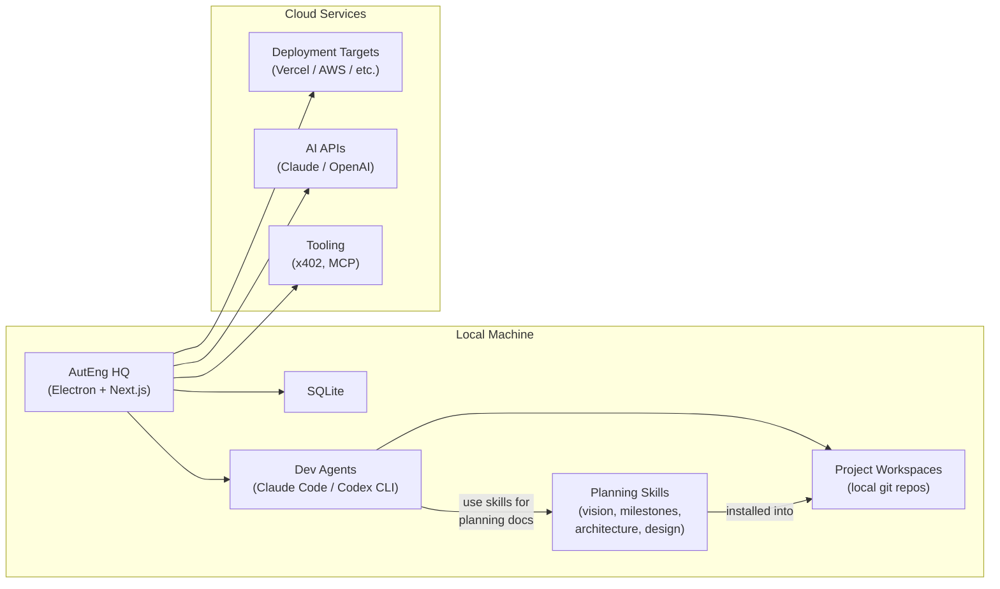
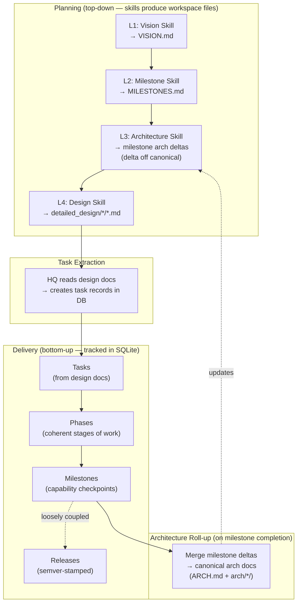
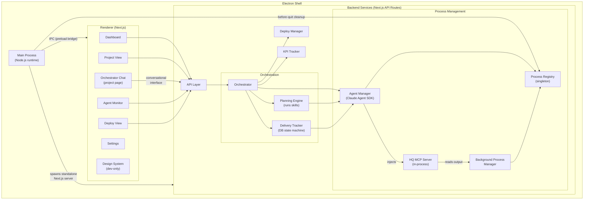
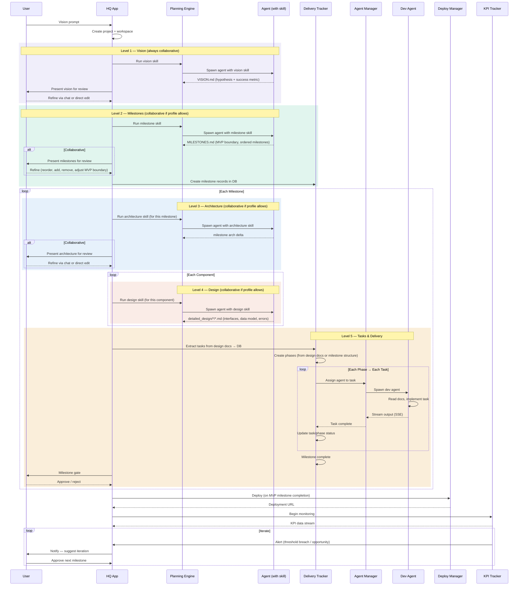
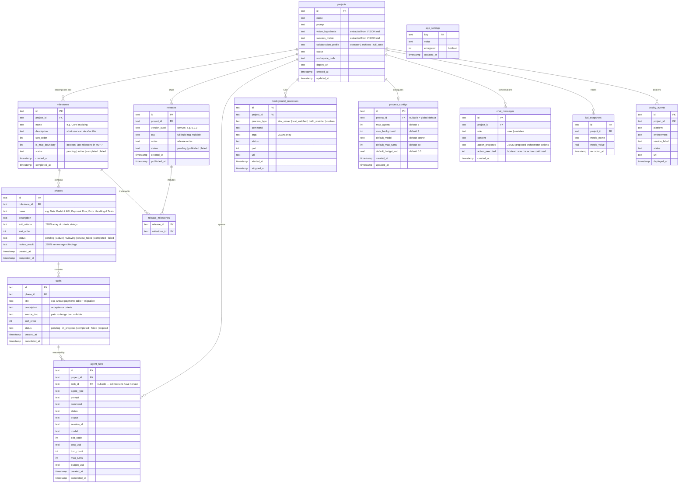

# ARCH — AutEng HQ

> Local-first desktop application that decomposes product visions into milestones, architecture, design, and tasks — then orchestrates AI agents to build, deploy, and monitor them to first revenue.
> Level: System
> See [VISION.md](./VISION.md) for product scope and the 0-to-$1 methodology.

---

## System Overview



Everything runs locally. HQ is the cockpit — it decomposes visions, orchestrates agents, tracks delivery, triggers deploys, and monitors KPIs. Cloud services are consumed on-demand; HQ never depends on them for core operation.

**Deferred to v1+**: Mobile companion app (React Native / Expo) with WebSocket real-time sync. See [PLAN.md](./PLAN.md) deferred items.

## Planning vs Delivery Architecture

HQ implements the [From Vision to Version Number](./from-vision-to-version-number.html) methodology. The system splits into two loosely coupled halves: **planning** (top-down, produces files) and **delivery** (bottom-up, tracks state in the database).



**Planning artifacts** live as markdown files in the project workspace, generated by AI agents equipped with domain skills. They are versioned by git and human-reviewable. Skills encode the expertise for each decomposition level — a vision skill extracts hypotheses, an architecture skill identifies components, a design skill specifies interfaces.

**Architecture docs have a two-phase lifecycle**: the architecture skill produces **milestone deltas** in `docs/milestones/<name>/` during planning. These are not standalone docs — they describe only what's *changing* relative to the canonical arch docs. Agents reference both canonical docs and the milestone delta during implementation. When the milestone completes, the deltas are **rolled up** into the canonical architecture docs — `docs/ARCH.md` (top-level system overview) and `docs/arch/` (subsystems, cross-cutting concerns, app-level arch with possible sub-composition). The canonical set always represents the current system state. Milestone directories are kept for historical reference.

**Delivery artifacts** live in HQ's SQLite database. Milestones, phases, tasks, and releases are structured entities with statuses, ordering, and relationships. The orchestrator sequences work, assigns agents to tasks, and stamps releases. This enables real-time dashboards, progress tracking, and automated phase transitions.

**The bridge** is task extraction: HQ reads completed design documents and creates task records in the database, linking each task back to its source design doc. This is where planning meets delivery.

### Collaboration Depth

Not every user wants to collaborate at every level. A product manager cares about vision and milestones but wants architecture, design, and delivery to run autonomously. An engineer wants to collaborate on architecture and design but is happy to let the agent handle vision framing. HQ makes this configurable per project via a **collaboration profile** that controls which levels pause for user review.

| Level | Collaborative | Autonomous |
|-------|--------------|------------|
| **L1: Vision** | User reviews and refines hypothesis + success metric via chat or direct edit | Agent generates VISION.md, proceeds immediately |
| **L2: Milestones** | User reviews milestone list, reorders, adjusts MVP boundary, adds/removes | Agent generates MILESTONES.md, proceeds immediately |
| **L3: Architecture** | User reviews component breakdown, suggests alternatives | Agent generates ARCH.md per milestone, proceeds immediately |
| **L4: Design** | User reviews interfaces, data models, error states | Agent generates `detailed_design/` docs, proceeds immediately |
| **L5: Delivery** | Milestone gates (approve/reject on completion) | Tasks execute and milestones auto-complete |

Three built-in presets, configurable per project:

| Preset | Collaborative at | Autonomous at | Best for |
|--------|-----------------|---------------|----------|
| **Operator** | Vision, Milestones | Architecture, Design, Delivery | Product managers, non-technical founders — shape *what* to build, let agents decide *how* |
| **Architect** | Vision, Milestones, Architecture, Design | Delivery | Engineers — collaborate on technical decisions, let agents execute |
| **Full auto** | Vision | Milestones, Architecture, Design, Delivery | Maximum speed — review the vision, then let it run |

Vision is always collaborative by default — it's the user's bet, and getting it wrong wastes everything downstream. Users can override any preset to make individual levels collaborative or autonomous.

When a level is collaborative, the orchestrator pauses after the skill completes and presents the output for review via the orchestrator chat. The user can refine, regenerate, or approve. When autonomous, the orchestrator proceeds to the next level immediately.

Milestone gates (approve/reject on milestone completion) are separate from collaboration depth — they're always available regardless of preset, but in autonomous delivery mode they auto-approve unless the user intervenes.

## Component Architecture



The Electron main process launches a standalone Next.js server and loads it in a BrowserWindow. The preload bridge exposes a minimal IPC API (`app:minimize`, `app:maximize`, `app:close`) with context isolation. Backend services run as Next.js API routes within the same process. The Process Registry singleton (on `globalThis`) tracks all running agent and background processes, enforcing concurrency limits and enabling clean shutdown on app quit.

The orchestration layer splits into three components:
- **Orchestrator** — top-level coordinator that drives both planning and delivery. Assigns agents to individual tasks with contextual prompts, auto-advances to next task on completion, triggers phase review agents, triggers arch roll-up on milestone completion, and respects collaboration profiles
- **Planning Engine** — runs skills (vision, milestones, architecture, design) by spawning agents with skill context, producing workspace files. Chains skills sequentially using agent completion callbacks
- **Delivery Tracker** — state machine that manages milestone/phase/task progression in the database, enforces valid status transitions, detects phase and milestone completion via cascade logic

### Orchestrator Chat

The project page includes a conversational interface to the orchestrator. Users can chat with the orchestrator to:
- Ask about project status, current phase, blocking tasks
- Request the orchestrator to start/skip/retry specific milestones or tasks
- Ask why a task failed and get the agent's output summary
- Trigger re-planning (re-run a skill to regenerate architecture or design docs)
- Approve or reject milestone completions conversationally

The chat is backed by a Claude API call with the project's full context (milestone state, task statuses, recent agent outputs, workspace docs) injected as system context. The orchestrator chat is distinct from agent output — it's a meta-layer for controlling and querying the decomposition/delivery pipeline, not for writing code.

## Data Flow — Vision to Revenue

The core lifecycle from VISION: **Decompose → Build → Deploy → Earn**.



## Database Schema

Planning artifacts (vision docs, milestone definitions, architecture documents, component design specs) live as files in the project workspace — managed by skills and versioned by git. Delivery artifacts (milestone progress, phase sequencing, task status, release versions) live in the database — enabling real-time orchestration, status dashboards, and agent-task linkage.

This split follows the methodology: top-down planning produces files, bottom-up delivery consumes a structured DB.



**Versioning rules** (from the methodology):
- **major** — broke the public contract (API, schema, auth). Architectural epoch shift.
- **minor** — new capability shipped. Often aligns with a milestone completion.
- **patch** — fix within a milestone. Maps to one or a few tasks.
- **date-commit** — build metadata for CI/CD traceability. Not a planning artifact.

Milestones and releases are **loosely coupled** via the `release_milestones` join table. Sometimes a release spans parts of two milestones; sometimes one milestone has multiple releases. Milestones define "what's done." Releases define "what ships and with what compatibility promises."

See [TAXONOMY.md](./TAXONOMY.md) for status enums and naming conventions.

## Component Boundaries

| Component | Owns | Does NOT Own |
|-----------|------|-------------|
| **Electron Main** | Window lifecycle, IPC bridge, spawning Next.js server, native OS integration, triggering process cleanup on quit | UI rendering, business logic |
| **Orchestrator** | Full lifecycle coordination: vision → milestones → architecture → design → tasks → phases → releases. Approval gates, orchestrator chat responses | Agent implementation details, skill content |
| **Planning Engine** | Running skills for each decomposition level (vision, milestones, architecture, design). Spawning agents with skill context. Producing workspace files | Delivery tracking, task execution |
| **Delivery Tracker** | Milestone/phase/task state machine in DB. Task extraction from design docs. Phase transitions. Milestone completion detection. Release stamping | Planning (that's the Planning Engine), what agents build |
| **Orchestrator Chat** | Conversational interface on project page. Injecting project state as context. Interpreting user intent into orchestrator actions | Direct code generation, agent output streaming |
| **Process Registry** | In-memory map of all running processes (agents + background), concurrency limit enforcement, lifecycle events | Process implementation details, DB persistence |
| **Agent Manager** | Spawning/killing Claude Agent SDK `query()` instances, streaming output (SSE), recording run results, session resume. Agents linked to tasks via `task_id` | What the agent builds, background processes |
| **Background Process Manager** | Spawning/killing dev servers, test watchers, build watchers; ring-buffered output capture; health checks; port detection | Agent processes, what the processes produce |
| **HQ MCP Server** | In-process MCP tools that agents use to interact with HQ (read background process output, start/stop processes) | Agent logic, process implementation |
| **Deploy Manager** | Triggering deployments, tracking URLs and status | Hosting infrastructure |
| **KPI Tracker** | Collecting, storing, and surfacing metrics; threshold alerting | Defining what metrics matter (that's in the project's VISION) |
| **Design System** | Token definitions, component registry, dev-only `/design-system` route (see [DESIGN_SYSTEM.md](./DESIGN_SYSTEM.md)) | Business logic, data flow |

## Integration Points

| Protocol | Used For | Direction |
|----------|----------|-----------|
| **Electron IPC** | Window controls, native OS features (preload bridge with context isolation) | Main ↔ Renderer |
| **Claude Agent SDK** | Programmatic agent spawning via `query()` — typed streaming, abort, resume, tool control. Used for both planning agents (with skills) and dev agents (with tasks) | HQ → Agent subprocess |
| **Claude API** | Orchestrator chat — conversational project control with project state as context | HQ → Claude API |
| **In-process MCP** | HQ MCP server injected into agents via SDK `mcpServers` option — agents pull background process output, start/stop dev servers | Agent → HQ (within same Node.js process) |
| **stdio** | Background process communication (dev servers, test watchers, build watchers as child processes) | HQ ↔ Background process |
| **SSE** | Streaming agent output to UI in real-time | Backend → Renderer |
| **REST** | Internal API routes, cloud deployments, AI API calls | Renderer → API, HQ → Cloud |
| **MCP** | Tool integration (agents ↔ external services) | Bidirectional |
| **x402** | Pay-per-request X402 | HQ → Cloud |

**Deferred to v1+**: WebSocket (Socket.io) for mobile companion app real-time sync.

## Tech Stack

| Layer | Technology | Why |
|-------|-----------|-----|
| Desktop shell | Electron 40 | Cross-architecture macOS distribution, native OS integration, embeds Node.js runtime |
| UI framework | Next.js 16 (React 19) | SSR for fast renders, API routes as backend, standalone output for Electron |
| Styling | Tailwind CSS 4 + shadcn/ui v4 | Utility-first with OKLch token system, Radix primitives for accessibility |
| Component primitives | Radix UI | Accessible, unstyled primitives consumed via shadcn |
| Local database | SQLite (better-sqlite3 + Drizzle ORM) | Zero-config embedded DB, WAL mode for concurrent reads, type-safe queries |
| Agent orchestration | Claude Agent SDK (`@anthropic-ai/claude-agent-sdk`) | Typed `query()` API for spawning Claude instances with streaming, abort, resume, MCP injection, budget/turn limits |
| Agent streaming | SSE (Server-Sent Events) | One-way real-time stream from agent processes to UI |
| Package manager | pnpm 10 | Workspace support, strict dependency resolution, disk-efficient |
| Monorepo | Turborepo | Task orchestration, caching, dependency graph across apps/packages |
| Desktop packaging | electron-builder | macOS .dmg builds for arm64 + x86_64, pnpm symlink handling |
| Language | TypeScript 5.9 (strict) | End-to-end type safety |
| Icons | lucide-react | Consistent icon set, tree-shakeable |

## Target Architecture

| Component | Platform | Architecture | Notes |
|-----------|----------|-------------|-------|
| HQ Desktop | macOS | arm64 (Apple Silicon) | Primary target, Electron |
| HQ Desktop | macOS | x86_64 (Intel) | Secondary target, Electron |
| Dev Agents | macOS | Host architecture | Claude Code / Codex CLI run as child processes |
| SQLite DB | Local filesystem | `data/hq.db` or `HQ_DATA_DIR` env | WAL mode, foreign keys enabled |
| Project Workspaces | Local filesystem | User-configured path | One git repo per project |

**Runtime requirements**: Node.js (bundled with Electron), git (system install).

**Deferred platforms**: Linux and Windows desktop (v1+), mobile iOS/Android (v1+).

## Key Decisions

| Decision | Choice | Alternatives Considered |
|----------|--------|------------------------|
| Local-first vs cloud | **Local-first** — all data on user's machine | Cloud-hosted SaaS — rejected: contradicts user control principle, adds auth/billing complexity |
| Desktop framework | **Electron** | Tauri — smaller binary but less Node.js ecosystem support for agent spawning via stdio |
| Database | **SQLite** | PostgreSQL — unnecessary for local single-user app. IndexedDB — no server-side access for API routes |
| Planning artifacts storage | **Workspace files** (managed by skills, versioned by git) | Database — rejected: agents work best with files, git provides history, avoids duplicating structured content |
| Delivery tracking storage | **Database** (milestones, phases, tasks, releases in SQLite) | Markdown files parsed at runtime — rejected: delivery needs querying, status aggregation, real-time updates, and agent-task linkage. Parsing markdown was fragile and couldn't support the full entity model |
| Orchestrator chat | **Claude API with project state context** | Agent SDK — rejected: chat is conversational, not tool-using. WebSocket to dedicated service — unnecessary complexity for local app |
| Agent interface | **Claude Agent SDK** (`query()` API) | Raw CLI spawning (`claude -p`) — requires manual NDJSON parsing, no typed messages, no abort/resume. Anthropic API SDK directly — loses Claude Code's built-in tools (file editing, bash, grep). Docker — too heavy for local dev agents |
| Agent permissions | **Full bypass** (`permissionMode: 'bypassPermissions'`) | Per-tool allowlists — adds UI complexity. HQ is the trust boundary; agents scoped to project workspace via `cwd` |
| Agent output streaming | **SSE** | WebSocket — bidirectional not needed for output streaming. Polling — poor UX for real-time output |
| Background output feedback | **In-process MCP server** (agents pull on demand) | Push into agent context — risks context explosion. Log files — agents can't query filtered output. Shared memory — unnecessary complexity |
| UI within Electron | **Next.js standalone server** | Static export — loses API routes. Vite — no built-in API route layer |
| ORM | **Drizzle** | Prisma — heavier runtime, SQLite support less mature. Raw SQL — loses type safety |
| Monorepo tool | **Turborepo** | Nx — heavier config. Lerna — less maintained |
| Free + open source | **No billing in HQ** | Freemium — rejected: HQ is the cockpit, not the engine. Users pay for cloud services directly |

## Process Management

HQ manages two categories of child processes: **agent processes** (Claude instances doing work) and **background processes** (dev servers, test watchers, build watchers). Both are tracked through a three-layer architecture:

```
ProcessRegistry (singleton on globalThis, survives hot reload)
  ├── AgentManager        — Claude Agent SDK query() instances
  └── BackgroundProcessManager — child_process.spawn for support processes
```

### Process Registry

Singleton in-memory map of all running processes. Stored on `globalThis[Symbol.for("auteng.processRegistry")]` to survive Next.js hot reloads. Enforces concurrency limits:

| Limit | Default | Scope |
|-------|---------|-------|
| Global max processes | 15 | All projects combined |
| Max agents per project | 5 | Per project |
| Max background processes per project | 3 | Per project |

Emits events: `process:started`, `process:stopped`, `process:failed`. Electron main process calls `shutdownAll()` on `before-quit`.

### Agent Manager

Wraps the Claude Agent SDK `query()` function. Each agent instance has:
- **AbortController** for clean cancellation
- **Session ID** for resume capability after HQ restart
- **Output accumulator** that batches DB writes (every 5s or 50 messages)
- **SSE stream** for real-time UI updates
- **Task ID** linking the run to a specific task in the delivery tracker (nullable for ad-hoc/planning runs)

Agents run with `permissionMode: 'bypassPermissions'` — HQ is the trust boundary. Each agent is scoped to its project workspace via `cwd`. The project's `CLAUDE.md` is auto-loaded via `settingSources: ['project']`.

On HQ restart: scan `agent_runs` for `status=running`, mark as `failed`. User can resume via stored `session_id`.

### Background Process Manager

Manages long-lived support processes via `child_process.spawn`:

| Process Type | Examples | Special Behavior |
|-------------|----------|-----------------|
| `dev_server` | `next dev`, `vite dev` | Port detection (parse stdout), health check polling |
| `test_watcher` | `vitest --watch`, `jest --watch` | — |
| `build_watcher` | `tsc --watch` | — |

Output captured in a **ring buffer** (500 lines, fixed-size circular). Agents access this via the HQ MCP Server — they pull output on demand rather than having it pushed into their context.

Shutdown cascade: SIGTERM → 5s → SIGINT → 3s → SIGKILL.

### HQ MCP Server

In-process MCP server created via `createSdkMcpServer()` and injected into every agent instance through the SDK's `mcpServers` option. Exposes tools:

| Tool | Purpose |
|------|---------|
| `get_process_output(projectId, processType?, lines?)` | Read recent ring buffer content |
| `get_dev_server_url(projectId)` | Get running dev server URL |
| `get_process_status(projectId)` | Status of all background processes |
| `start_process(processType, command, args)` | Start a background process |
| `stop_process(projectId, processType?)` | Stop background processes |

This is the key integration between agents and background processes. Agents can check compilation errors, test results, or dev server status without the output being pushed into their context window.

## Architectural Considerations

### Performance

- **Target**: Support 10+ concurrent projects without UI lag
- **SQLite WAL mode**: Enables concurrent reads while writing agent output and delivery state
- **SSE streaming**: Agent output rendered incrementally, not buffered
- **Turborepo caching**: Rebuilds only what changed across the monorepo
- **Delivery queries**: Milestone/phase/task status aggregation uses indexed columns (`project_id`, `milestone_id`, `status`)

### Scalability

- **Agent concurrency**: ProcessRegistry enforces limits — 15 total processes, 5 agents per project, 3 background processes per project. Configurable via `process_configs` table. Each SDK `query()` spawns a Claude Code subprocess
- **Memory**: Ring buffers cap background output at 500 lines per process. Agent output accumulated in memory and flushed to DB in batches
- **Database growth**: SQLite handles single-digit GB well. Agent output (`agent_runs.output`) is the largest growth vector — may need rotation or archival for long-running projects
- **Multi-project**: Dashboard aggregation queries should use indexed columns (`project_id`, `status`, `created_at`)

### Security

- **Local-first**: No network-exposed services. Data never leaves the machine unless the user deploys
- **Electron context isolation**: Preload bridge with explicit allowlisted IPC channels
- **API keys**: Stored locally (env vars or encrypted config). Never committed to project workspaces
- **Agent sandboxing**: Agents run via Claude Agent SDK with `permissionMode: 'bypassPermissions'` — HQ is the trust boundary. Each agent scoped to its project workspace via `cwd`. No cross-project filesystem access

### Observability

- **Every agent action logged**: Run records with command, output, exit code, timestamps, linked to tasks
- **Delivery state in DB**: Milestone/phase/task statuses queryable in real-time — no log parsing needed
- **Orchestrator chat history**: Conversational interactions stored for audit
- **KPI snapshots**: Time-series metrics for deployed projects

## Related Documents

| Document | Relationship |
|----------|-------------|
| [VISION.md](./VISION.md) | Product scope, 0-to-$1 methodology, success metrics — ARCH implements this |
| [from-vision-to-version-number.html](./from-vision-to-version-number.html) | Decomposition methodology reference — ARCH follows this framework |
| [PLAN.md](./PLAN.md) | HQ's own build plan — references ARCH for component design, schema, and process management |
| [TAXONOMY.md](./TAXONOMY.md) | Entity names, status enums, naming conventions — ARCH schema uses these |
| [WORKFLOW.md](./WORKFLOW.md) | Session protocol, feedback stages — ARCH components implement this |
| [DESIGN_SYSTEM.md](./DESIGN_SYSTEM.md) | Token architecture, component registry — consumed by Renderer |
| [CODING_STANDARDS.md](./CODING_STANDARDS.md) | Quality rules — applied during implementation |
