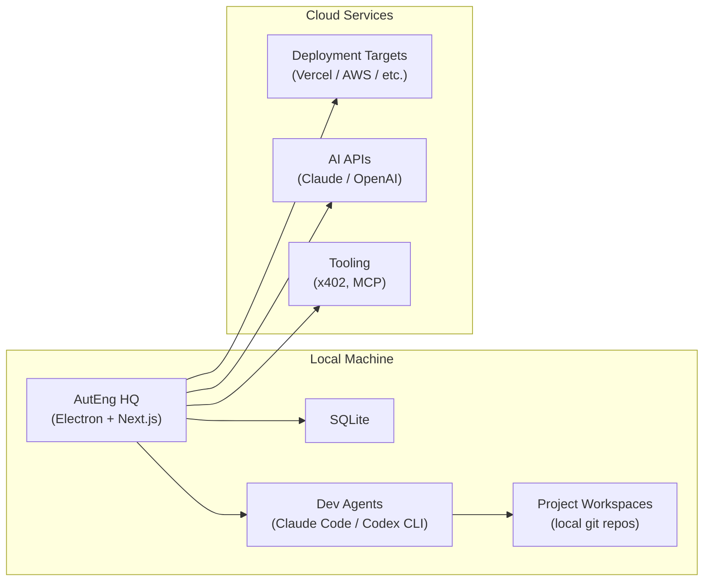
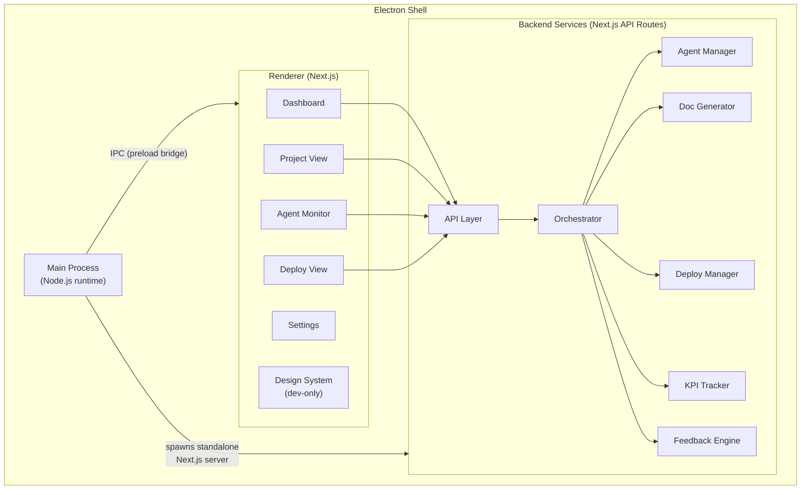
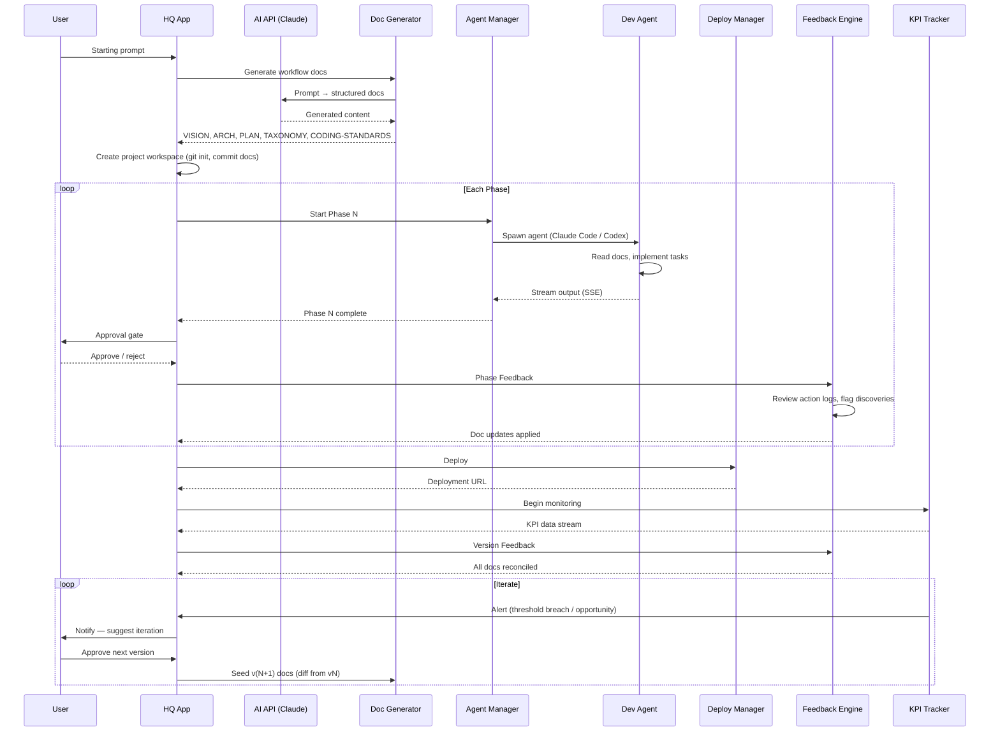
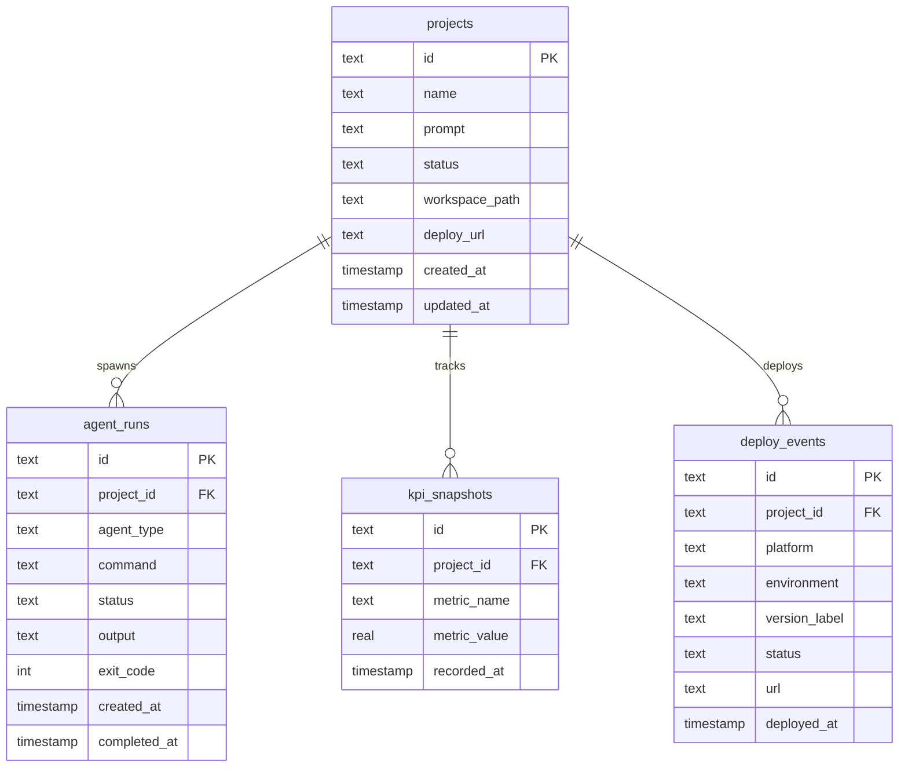

# ARCH — AutEng HQ

> Local-first desktop application for orchestrating AI agent-operated businesses.
> Level: System
> See [VISION.md](./VISION.md) for product scope and goals.

---

## System Overview

Everything runs locally. HQ is the cockpit — it orchestrates agents, manages projects, triggers deploys, and monitors KPIs. Cloud services are consumed on-demand; HQ never depends on them for core operation.

**Deferred to v1+**: Mobile companion app (React Native / Expo) with WebSocket real-time sync. See [PLAN.md](./PLAN.md) deferred items.

## Component Architecture

The Electron main process launches a standalone Next.js server and loads it in a BrowserWindow. The preload bridge exposes a minimal IPC API (`app:minimize`, `app:maximize`, `app:close`) with context isolation. Backend services run as Next.js API routes within the same process.

## Data Flow — Prompt to Product

The core lifecycle from VISION: **Prompt → Plan → Build → Deploy → Monitor → Iterate**.

## Database Schema

The work unit hierarchy (`Project → Version → Phase`) is tracked in each project's documentation (PLAN.md, PLAN_PROGRESS_LOG.md). The database tracks only what the docs can't: the project registry, runtime agent process records, time-series metrics, and deployment history.

**Design rationale:** Versions, phases, and their statuses live in the project's docs directory — PLAN.md defines them, PLAN_PROGRESS_LOG.md tracks progress, WORKFLOW_AUDIT.md logs orchestrator decisions. Duplicating this hierarchy in the DB would create two sources of truth. The DB owns runtime artifacts: which agent processes ran (and their output), what was deployed, and what metrics were collected. See [TAXONOMY.md](./TAXONOMY.md) for status enums.

## Component Boundaries

| Component | Owns | Does NOT Own |
|-----------|------|-------------|
| **Electron Main** | Window lifecycle, IPC bridge, spawning Next.js server, native OS integration | UI rendering, business logic |
| **Orchestrator** | Phase sequencing, project lifecycle, approval gates | Agent implementation details |
| **Agent Manager** | Spawning/killing agent processes, streaming output (SSE), recording run results | What the agent builds |
| **Doc Generator** | Generating workflow docs from prompt via AI API | Editing docs after generation (that's the Feedback Engine or agents) |
| **Deploy Manager** | Triggering deployments, tracking URLs and status | Hosting infrastructure |
| **KPI Tracker** | Collecting, storing, and surfacing metrics; threshold alerting | Defining what metrics matter (that's in the project's VISION) |
| **Feedback Engine** | Reviewing action logs, flagging doc updates, running feedback checklists (see [WORKFLOW.md](./WORKFLOW.md)) | Deciding *what* to change (that's the agent or user) |
| **Design System** | Token definitions, component registry, dev-only `/design-system` route (see [DESIGN_SYSTEM.md](./DESIGN_SYSTEM.md)) | Business logic, data flow |

## Integration Points

| Protocol | Used For | Direction |
|----------|----------|-----------|
| **Electron IPC** | Window controls, native OS features (preload bridge with context isolation) | Main ↔ Renderer |
| **stdio** | Local agent communication (Claude Code, Codex CLI child processes) | HQ ↔ Agent process |
| **SSE** | Streaming agent output to UI in real-time | Backend → Renderer |
| **REST** | Internal API routes, cloud deployments, AI API calls | Renderer → API, HQ → Cloud |
| **MCP** | Tool integration (agents ↔ external services) | Bidirectional |
| **x402** | Pay-per-request X402 | HQ → Cloud |

**Deferred to v1+**: WebSocket (Socket.io) for mobile companion app real-time sync.

## Tech Stack

| Layer | Technology | Why |
|-------|-----------|-----|
| Desktop shell | Electron 40 | Cross-architecture macOS distribution, native OS integration, embeds Node.js runtime |
| UI framework | Next.js 16 (React 19) | SSR for fast renders, API routes as backend, standalone output for Electron |
| Styling | Tailwind CSS 4 + shadcn/ui v4 | Utility-first with OKLch token system, Radix primitives for accessibility |
| Component primitives | Radix UI | Accessible, unstyled primitives consumed via shadcn |
| Local database | SQLite (better-sqlite3 + Drizzle ORM) | Zero-config embedded DB, WAL mode for concurrent reads, type-safe queries |
| Agent streaming | SSE (Server-Sent Events) | One-way real-time stream from agent processes to UI |
| Package manager | pnpm 10 | Workspace support, strict dependency resolution, disk-efficient |
| Monorepo | Turborepo | Task orchestration, caching, dependency graph across apps/packages |
| Desktop packaging | electron-builder | macOS .dmg builds for arm64 + x86_64, pnpm symlink handling |
| Language | TypeScript 5.9 (strict) | End-to-end type safety |
| Icons | lucide-react | Consistent icon set, tree-shakeable |

## Target Architecture

| Component | Platform | Architecture | Notes |
|-----------|----------|-------------|-------|
| HQ Desktop | macOS | arm64 (Apple Silicon) | Primary target, Electron |
| HQ Desktop | macOS | x86_64 (Intel) | Secondary target, Electron |
| Dev Agents | macOS | Host architecture | Claude Code / Codex CLI run as child processes |
| SQLite DB | Local filesystem | `data/hq.db` or `HQ_DATA_DIR` env | WAL mode, foreign keys enabled |
| Project Workspaces | Local filesystem | User-configured path | One git repo per project |

**Runtime requirements**: Node.js (bundled with Electron), git (system install).

**Deferred platforms**: Linux and Windows desktop (v1+), mobile iOS/Android (v1+).

## Key Decisions

| Decision | Choice | Alternatives Considered |
|----------|--------|------------------------|
| Local-first vs cloud | **Local-first** — all data on user's machine | Cloud-hosted SaaS — rejected: contradicts user control principle, adds auth/billing complexity |
| Desktop framework | **Electron** | Tauri — smaller binary but less Node.js ecosystem support for agent spawning via stdio |
| Database | **SQLite** | PostgreSQL — unnecessary for local single-user app. IndexedDB — no server-side access for API routes |
| Agent communication | **stdio (child process)** | HTTP API to agents — unnecessary overhead. Docker containers — too heavy for local dev agents |
| Agent output streaming | **SSE** | WebSocket — bidirectional not needed for output streaming. Polling — poor UX for real-time output |
| UI within Electron | **Next.js standalone server** | Static export — loses API routes. Vite — no built-in API route layer |
| ORM | **Drizzle** | Prisma — heavier runtime, SQLite support less mature. Raw SQL — loses type safety |
| Doc generation | **AI API (Claude)** | Templates — too rigid. User-authored — defeats prompt-to-product goal |
| Monorepo tool | **Turborepo** | Nx — heavier config. Lerna — less maintained |
| Free + open source | **No billing in HQ** | Freemium — rejected: HQ is the cockpit, not the engine. Users pay for cloud services directly |

## Architectural Considerations

### Performance

- **Target**: Support 10+ concurrent projects without UI lag (VISION success metric)
- **SQLite WAL mode**: Enables concurrent reads while writing agent output
- **SSE streaming**: Agent output rendered incrementally, not buffered
- **Turborepo caching**: Rebuilds only what changed across the monorepo

### Scalability

- **Agent concurrency**: Bounded by local CPU/memory. Orchestrator manages limits per machine
- **Database growth**: SQLite handles single-digit GB well. Agent output (`agent_runs.output`) is the largest growth vector — may need rotation or archival for long-running projects
- **Multi-project**: Dashboard aggregation queries should use indexed columns (`project_id`, `status`, `created_at`)

### Security

- **Local-first**: No network-exposed services. Data never leaves the machine unless the user deploys
- **Electron context isolation**: Preload bridge with explicit allowlisted IPC channels
- **API keys**: Stored locally (env vars or encrypted config). Never committed to project workspaces
- **Agent sandboxing**: Agents run as child processes with filesystem access scoped to project workspaces

### Observability

- **Every agent action logged**: Run records with command, output, exit code, timestamps
- **Workflow audit trail**: Orchestrator decisions logged to WORKFLOW_AUDIT.md per project
- **Plan progress tracking**: Task completions logged to PLAN_PROGRESS_LOG.md per project
- **KPI snapshots**: Time-series metrics for deployed projects

## Related Documents

| Document | Relationship |
|----------|-------------|
| [VISION.md](./VISION.md) | Product scope, target users, success metrics — ARCH implements this |
| [PLAN.md](./PLAN.md) | Phased build plan — references ARCH for component design and schema |
| [TAXONOMY.md](./TAXONOMY.md) | Entity names, status enums, naming conventions — ARCH schema uses these |
| [WORKFLOW.md](./WORKFLOW.md) | Session protocol, feedback stages — ARCH components implement this |
| [DESIGN_SYSTEM.md](./DESIGN_SYSTEM.md) | Token architecture, component registry — consumed by Renderer |
| [CODING-STANDARDS.md](./CODING-STANDARDS.md) | Quality rules — applied during implementation |
