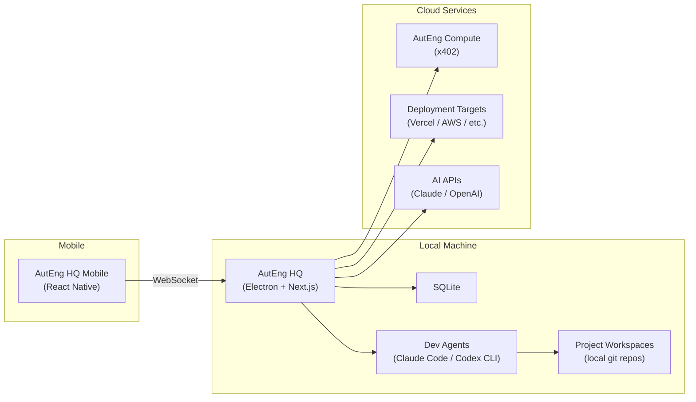
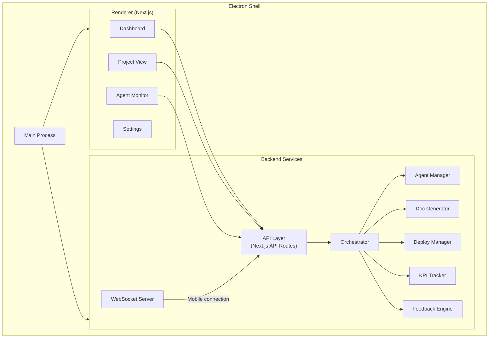
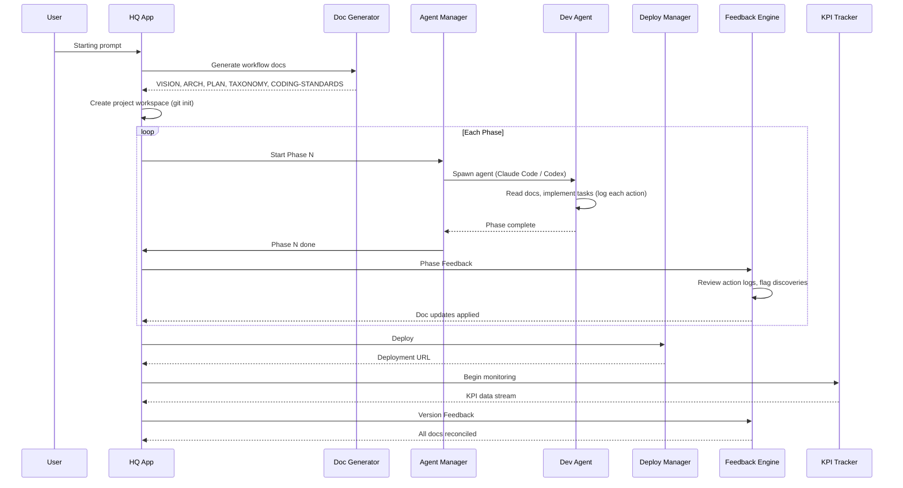
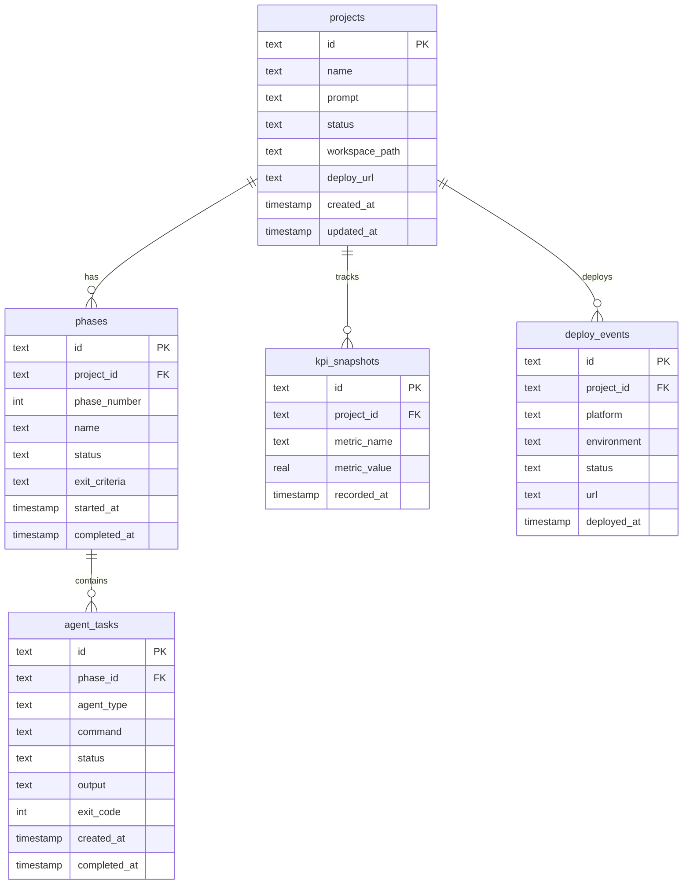

# ARCH — AutEng HQ

## System Overview

## Component Architecture

## Data Flow — Prompt to Product

## Database Schema

## Component Boundaries

| Component | Owns | Does NOT Own |
|-----------|------|-------------|
| **Orchestrator** | Phase sequencing, project lifecycle | Agent implementation details |
| **Agent Manager** | Spawning/killing agents, collecting output | What the agent builds |
| **Doc Generator** | Generating workflow docs from prompt | Editing docs after generation |
| **Deploy Manager** | Triggering deployments, tracking URLs | Hosting infrastructure |
| **KPI Tracker** | Collecting and storing metrics | Defining what metrics matter (that's in project VISION) |
| **Feedback Engine** | Reviewing action logs, flagging doc updates needed, running feedback checklists (see WORKFLOW.md) | Deciding *what* to change (that's the agent or user) |
| **WebSocket Server** | Mobile ↔ HQ real-time connection | Mobile app UI |

## Integration Points

| Protocol | Used For | Direction |
|----------|----------|-----------|
| **MCP** | Tool integration (agents ↔ external services) | Bidirectional |
| **x402** | Pay-per-request compute via AutEng | HQ → AutEng |
| **WebSocket** | Mobile app real-time control | Mobile ↔ HQ |
| **REST** | Cloud deployments, AI APIs | HQ → Cloud |
| **stdio** | Local agent communication (Claude Code, Codex) | HQ ↔ Agent process |

## Tech Stack

| Layer | Technology |
|-------|-----------|
| Desktop shell | Electron |
| UI framework | Next.js (React) |
| Styling | Tailwind CSS |
| Local database | SQLite (via better-sqlite3 or drizzle) |
| Real-time | Socket.io |
| Mobile app | React Native (Expo) |
| Monorepo | Turborepo |
| Language | TypeScript throughout |
