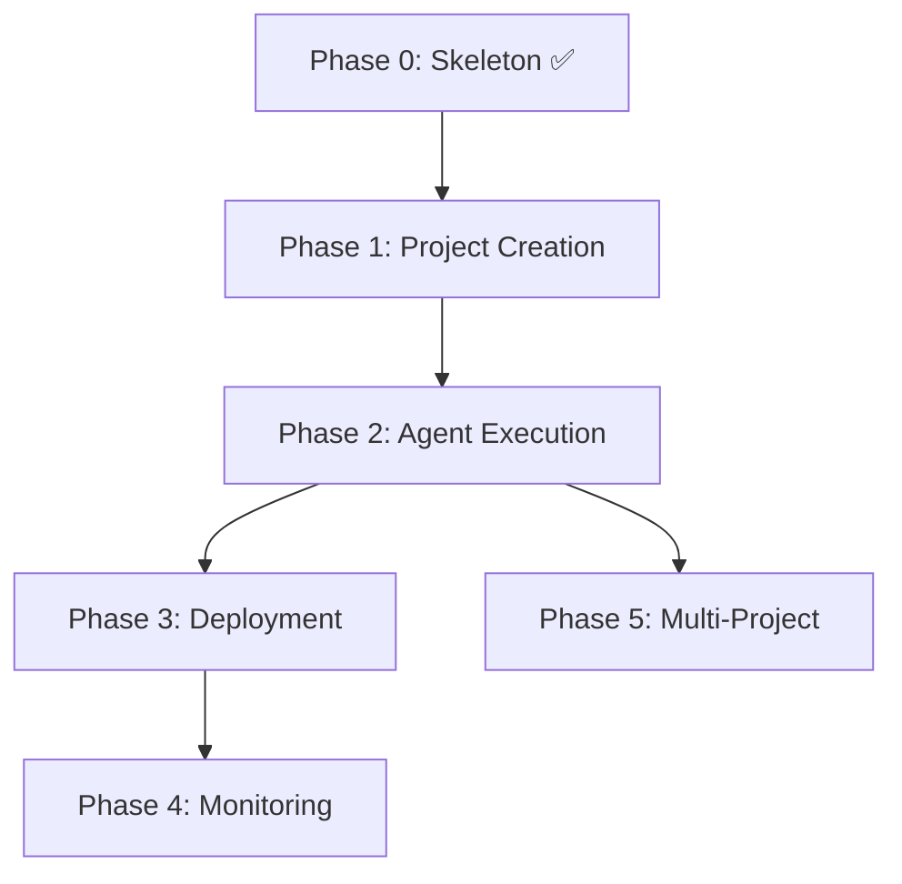
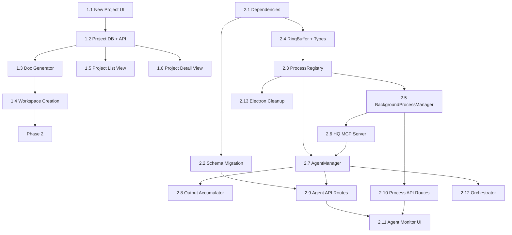

# PLAN — AutEng HQ

## Current State

Phase 1 complete. Project creation working end-to-end:
- Electron + Next.js app with sidebar navigation, dashboard, project list
- SQLite database with schema and auto-creation on fresh install
- Project CRUD API with Zod validation
- Doc Generator (Claude API) with SSE streaming progress
- Workspace creation (git init, CLAUDE.md, 5 workflow docs)
- Project detail view with tabbed doc viewer
- 55-test suite (validations, API routes, services, components)
- `.dmg` build pipeline with native module rebuild and auto version bumping

## Future State

See [ARCH.md](./ARCH.md) — a fully functioning Electron + Next.js desktop app distributable as .dmg, with mobile companion app, managing multiple agent-operated businesses.

## Version: v0 (MVP)

### Phase 0 — Skeleton ✅

**From**: Bare Next.js + shadcn scaffold in `hq/`
**To**: Bootable Electron + Next.js app with empty dashboard

| Task | Description |
|------|-------------|
| 0.1 | Move `hq/` → `apps/hq/`, add Turborepo config at root, `packages/shared/` stub |
| 0.2 | Electron shell wrapping the Next.js app (electron-builder) |
| 0.3 | Build pipeline: dev (hot reload) and production (.dmg) |
| 0.4 | Add L3 semantic status tokens to `globals.css` (see DESIGN_SYSTEM.md) |
| 0.5 | Add shadcn components needed for shell: Sidebar, Card, Badge, Input, Separator, Tooltip, Avatar, Skeleton |
| 0.6 | Dashboard shell layout with sidebar navigation (projects, agents, deploys, settings) |
| 0.7 | Component registry (`components/registry/`) with types, entries, helpers, demo-map |
| 0.8 | Design system route (`/design-system`) with token browser and component gallery (dev-only) |
| 0.9 | SQLite database initialized with schema from ARCH.md (Drizzle ORM) |
| 0.10 | API route scaffolding (`app/api/`) for projects, agents, deploys |

**Exit Criteria**: App launches locally. Build produces a working .dmg. SQLite DB created on first launch.

**Feedback**: Reconcile docs against actual skeleton. Update ARCH.md if tech stack decisions changed during setup.

---

### Phase 1 — Project Creation ✅

**From**: Empty dashboard, no projects
**To**: User creates projects from a prompt, gets auto-generated workflow docs, sees them in dashboard

| Task | Description |
|------|-------------|
| 1.1 | "New Project" UI: prompt input form (dedicated page) |
| 1.2 | Project CRUD API with Zod validation |
| 1.3 | Doc Generator: prompt → VISION, ARCH, PLAN, TAXONOMY, CODING-STANDARDS (via Claude API) |
| 1.4 | Local workspace creation (`git init`, CLAUDE.md generation) |
| 1.5 | Project list view on dashboard with status badges |
| 1.6 | Project detail view showing generated docs, status, and phase breakdown |

**Exit Criteria**: Prompt → project with 5 docs + CLAUDE.md → git repo on disk → visible in dashboard → project detail shows rendered docs.

**Feedback**: Validate doc generation quality. Update ARCH.md if Doc Generator component boundaries shifted.

#### Detailed Breakdown

##### 1.1 — New Project UI

| Detail | Description |
|--------|-------------|
| **What** | "New Project" page or modal with prompt input |
| **UI** | Full-page form: project name (auto-suggested from prompt), prompt textarea, model selector (sonnet/opus/haiku), "Create" button |
| **Route** | `/projects/new` (dedicated page, not modal — room for future expansion) |
| **Components** | Form using shadcn Input, Textarea, Select, Button. Validation: prompt required, min 20 chars |
| **State** | Client-side form state. On submit → POST `/api/projects` |

##### 1.2 — Project DB + API

| Detail | Description |
|--------|-------------|
| **What** | CRUD API for projects |
| **POST `/api/projects`** | Create project record (status: `draft`), return project ID |
| **GET `/api/projects`** | List all projects (existing scaffold, add filtering by status) |
| **GET `/api/projects/:id`** | Single project with phases |
| **PATCH `/api/projects/:id`** | Update status, name, deploy_url |
| **DELETE `/api/projects/:id`** | Soft delete (status → `archived`) |
| **Validation** | Zod schemas for request bodies |

##### 1.3 — Doc Generator

| Detail | Description |
|--------|-------------|
| **What** | Transform user prompt into 5 workflow docs for the new project |
| **Input** | Project prompt + name |
| **Output** | VISION.md, ARCH.md, PLAN.md, TAXONOMY.md, CODING-STANDARDS.md |
| **Implementation** | `lib/services/doc-generator.ts` — calls Claude API (`@anthropic-ai/sdk`) with structured prompts |
| **Model** | User-selected (default: sonnet). Each doc generated as a separate API call for quality |
| **Prompt strategy** | System prompt defines the doc format/structure (derived from our own docs as templates). User prompt provides the product idea. Chain: VISION first → feed into ARCH → feed into PLAN → TAXONOMY and CODING-STANDARDS in parallel |
| **Error handling** | Retry once on failure. Store partial results. User can regenerate individual docs |
| **Status flow** | Project `draft` → `planning` (during generation) → `planning` (complete, ready for build) |

##### 1.4 — Workspace Creation

| Detail | Description |
|--------|-------------|
| **What** | Create local git repo for the project with generated docs |
| **Path** | Configurable base directory (default: `~/auteng-projects/<project-slug>/`) |
| **Steps** | 1. Create directory. 2. `git init`. 3. Write generated docs to `docs/`. 4. Generate `CLAUDE.md` at repo root (project-specific instructions for agents). 5. `git add . && git commit -m "init: generated workflow docs"` |
| **CLAUDE.md generation** | Auto-generated from project docs — includes project name, tech stack (from ARCH), coding standards summary, doc read order. This is what agents load via `settingSources: ['project']` |
| **DB update** | Set `projects.workspace_path` to the created directory |

##### 1.5 — Project List View

| Detail | Description |
|--------|-------------|
| **What** | Dashboard showing all projects with status |
| **Route** | `/projects` (update existing stub) |
| **UI** | Card grid or table. Each card: project name, status badge, prompt preview (truncated), created date, workspace path. Click → project detail |
| **Data** | GET `/api/projects` with client-side SWR or React Query |
| **Empty state** | "No projects yet" with prominent "New Project" CTA |
| **Filtering** | Status filter tabs: All, Active, Deployed, Archived |

##### 1.6 — Project Detail View

| Detail | Description |
|--------|-------------|
| **What** | Single project view showing docs, status, and phase breakdown |
| **Route** | `/projects/:id` |
| **Sections** | Header (name, status badge, actions), Docs tab (rendered markdown for each generated doc), Phases tab (from project's PLAN.md, parsed), Agents tab (placeholder for Phase 2), Deploys tab (placeholder for Phase 3) |
| **Actions** | "Start Build" button (triggers Phase 2 agent execution — wired in Phase 2), "Edit Prompt" (regenerate docs), "Archive" |

---

### Phase 2 — Agent Execution

**From**: Projects exist with generated docs but nothing is built
**To**: HQ spawns multiple Claude agents per project, streams output to UI, manages background processes (dev servers, test watchers, build watchers), records everything in DB

**Key architecture decision**: Use `@anthropic-ai/claude-agent-sdk` for agent instances. See [ARCH.md](./ARCH.md) Process Management section.

| Task | Description |
|------|-------------|
| 2.1 | Install `@anthropic-ai/claude-agent-sdk`, `zod`, `uuid` |
| 2.2 | Schema migration: `background_processes` table, `agent_runs` additions, `process_configs` table |
| 2.3 | ProcessRegistry singleton (globalThis, concurrency limits, EventEmitter) |
| 2.4 | RingBuffer (500-line circular buffer) + shared process types |
| 2.5 | BackgroundProcessManager (dev_server, test_watcher, build_watcher) |
| 2.6 | HQ MCP Server via `createSdkMcpServer()` |
| 2.7 | AgentManager (SDK `query()` wrapper — spawn, cancel, resume, stream) |
| 2.8 | Output accumulator (batched DB writes every 5s or 50 messages) |
| 2.9 | Agent API routes: spawn, cancel, stream (SSE), resume |
| 2.10 | Background process API routes: start, stop, output |
| 2.11 | Agent Monitor UI (live output, status badges, cancel/resume) |
| 2.12 | Orchestrator: phase progression + user approval gates |
| 2.13 | Electron before-quit cleanup (`ProcessRegistry.shutdownAll()`) |

**Exit Criteria**: HQ spawns Claude agents via SDK, streams output to UI in real-time, records runs in DB. Background processes (dev server, test watcher, build watcher) managed with ring-buffered output. Agents pull background output via MCP tools. User approves phase transitions. All processes cleaned up on app quit.

**Feedback**: Refine agent spawning patterns. Update ARCH.md with any IPC mechanisms discovered. Update TAXONOMY.md if new agent statuses emerged.

#### Detailed Breakdown

##### 2.1 — Dependencies

| Detail | Description |
|--------|-------------|
| **What** | Install agent SDK and supporting packages |
| **Packages** | `@anthropic-ai/claude-agent-sdk`, `zod` (MCP tool schemas), `uuid` (process IDs) |
| **Command** | `pnpm --filter auteng-hq add @anthropic-ai/claude-agent-sdk zod uuid` |

##### 2.2 — Schema Migration

| Detail | Description |
|--------|-------------|
| **What** | Update DB schema for multi-agent support and background processes |
| **`agent_runs` table** (rename from `agentTasks`) | Add: `project_id` (FK, not null), make `phase_id` nullable, add `session_id`, `model`, `prompt`, `cost_usd`, `turn_count`, `max_turns`, `budget_usd` |
| **New: `background_processes` table** | `id`, `project_id` (FK), `process_type` (dev_server/test_watcher/build_watcher/custom), `command`, `args` (JSON), `status`, `port`, `url`, `started_at`, `stopped_at` |
| **New: `process_configs` table** | `id`, `project_id` (FK, nullable = global default), `max_agents`, `max_background`, `default_model`, `default_max_turns`, `default_budget_usd`, `created_at`, `updated_at` |
| **Migration** | `npx drizzle-kit generate && npx drizzle-kit push` |

##### 2.3 — ProcessRegistry Singleton

| Detail | Description |
|--------|-------------|
| **What** | Central in-memory registry of all running processes |
| **File** | `lib/process/process-registry.ts` |
| **Pattern** | Singleton on `globalThis[Symbol.for("auteng.processRegistry")]` (survives Next.js hot reload) |
| **Interface** | `register(process)`, `unregister(id)`, `getByProject(projectId)`, `getByType(type)`, `getAll()`, `count()`, `countByProject(projectId)` |
| **Events** | `EventEmitter`: `process:started`, `process:stopped`, `process:failed`, `process:output` |
| **Concurrency** | Checks limits on `register()`. Throws `ConcurrencyLimitError` if exceeded. Defaults: 15 global, 5 agents/project, 3 background/project |
| **Managed process shape** | `{ id, projectId, type: "agent" | "background", pid, status, startedAt, meta }` |

##### 2.4 — RingBuffer + Shared Types

| Detail | Description |
|--------|-------------|
| **What** | Fixed-size circular buffer for background process output + shared type definitions |
| **Files** | `lib/process/ring-buffer.ts`, `lib/process/types.ts` |
| **RingBuffer** | 500-line capacity (configurable). Methods: `push(line)`, `getAll()`, `getLast(n)`, `clear()`. Stores `{ timestamp, stream: "stdout" | "stderr", line }` |
| **Types** | `ManagedProcess`, `AgentInstance`, `BackgroundProcess`, `ProcessType`, `AgentConfig`, `ConcurrencyLimits` |

##### 2.5 — BackgroundProcessManager

| Detail | Description |
|--------|-------------|
| **What** | Manages long-lived support processes |
| **File** | `lib/process/background-process-manager.ts` |
| **Process types** | `dev_server` (next dev, vite dev, etc.), `test_watcher` (vitest --watch, jest --watch), `build_watcher` (tsc --watch) |
| **Spawn** | `child_process.spawn(command, args, { cwd, stdio: 'pipe' })`. Pipes stdout/stderr to RingBuffer |
| **Health checks** | Dev servers: poll health URL every 10s. All: monitor `exit` event |
| **Port detection** | For dev servers: parse stdout for "localhost:NNNN" pattern, record port |
| **Shutdown** | SIGTERM → 5s wait → SIGINT → 3s wait → SIGKILL. Graceful cascade |
| **DB** | Create/update `background_processes` records on start/stop/fail |
| **Key methods** | `start(projectId, processType, command, args, cwd)`, `stop(processId)`, `stopAllForProject(projectId)`, `getOutput(processId, lines?)`, `getDevServerUrl(projectId)` |

##### 2.6 — HQ MCP Server

| Detail | Description |
|--------|-------------|
| **What** | In-process MCP server injected into every agent via SDK's `mcpServers` option |
| **File** | `lib/process/hq-mcp-server.ts` |
| **Implementation** | `createSdkMcpServer()` from `@anthropic-ai/claude-agent-sdk` |
| **Tools** | `get_process_output(projectId, processType?, lines?)` — ring buffer content. `get_dev_server_url(projectId)` — URL string. `get_process_status(projectId)` — all background process statuses. `start_process(processType, command, args)` — start a background process. `stop_process(projectId, processType?)` — stop background processes |
| **Schemas** | Defined with `zod` for type safety |
| **Purpose** | Agents pull dev server output on demand (capped, filtered). No context explosion. Agents can also manage their own dev servers |

##### 2.7 — AgentManager

| Detail | Description |
|--------|-------------|
| **What** | Wraps Claude Agent SDK `query()` for spawning and managing agent instances |
| **File** | `lib/process/agent-manager.ts` |
| **Spawn flow** | 1. Check concurrency via ProcessRegistry. 2. Create `agent_runs` DB record (status: `queued`). 3. Create AbortController. 4. Call `query({ prompt, options })`. 5. Register with ProcessRegistry. 6. Update DB → `running`. 7. Consume AsyncGenerator in background loop. 8. On completion → update DB → `completed`/`failed`, unregister |
| **SDK options** | `cwd`: project workspace. `permissionMode: 'bypassPermissions'`. `model`: from config. `maxTurns`, `maxBudgetUsd`: from config. `mcpServers`: HQ MCP server. `settingSources: ['project']`: loads project CLAUDE.md |
| **Stream** | `streamOutput(agentId)` returns `ReadableStream` for SSE. Each `SDKMessage` forwarded to stream |
| **Cancel** | `cancel(agentId)` → `abortController.abort()`. DB → `cancelled`. Unregister |
| **Resume** | `resume(agentId)` → `query({ prompt, options: { resume: sessionId } })`. Re-register |
| **Key methods** | `spawn(projectId, prompt, config?)`, `cancel(agentId)`, `resume(agentId)`, `streamOutput(agentId)`, `getStatus(agentId)`, `listByProject(projectId)` |

##### 2.8 — Output Accumulator

| Detail | Description |
|--------|-------------|
| **What** | Batched DB writes for agent output (avoid per-token writes) |
| **File** | `lib/process/output-accumulator.ts` |
| **Strategy** | Accumulate `SDKMessage[]` in memory. Flush to `agent_runs.output` every 5 seconds or every 50 messages (whichever first). Final flush on completion/failure |
| **Format** | JSON array of messages stored in `output` column. Enables replay in UI |

##### 2.9 — Agent API Routes

| Detail | Description |
|--------|-------------|
| **What** | HTTP endpoints for agent lifecycle |
| **POST `/api/agents`** | Spawn agent. Body: `{ projectId, prompt, phaseId?, model?, maxTurns?, maxBudgetUsd? }`. Returns `{ agentId }` |
| **GET `/api/agents`** | List agents. Query params: `projectId`, `status`. Returns agent records from DB |
| **GET `/api/agents/:id`** | Agent status + metadata |
| **DELETE `/api/agents/:id`** | Cancel running agent |
| **GET `/api/agents/:id/stream`** | SSE endpoint. `Content-Type: text/event-stream`. Streams `SDKMessage` events. Closes on completion |
| **POST `/api/agents/:id/resume`** | Resume a stopped/failed agent session |

##### 2.10 — Background Process API Routes

| Detail | Description |
|--------|-------------|
| **What** | HTTP endpoints for background process management |
| **POST `/api/processes`** | Start background process. Body: `{ projectId, processType, command, args }` |
| **GET `/api/processes`** | List processes. Query params: `projectId`, `processType` |
| **GET `/api/processes/:id`** | Process status |
| **DELETE `/api/processes/:id`** | Stop process |
| **GET `/api/processes/:id/output`** | Ring buffer content. Query params: `lines` (default 50) |

##### 2.11 — Agent Monitor UI

| Detail | Description |
|--------|-------------|
| **What** | Live view of running agents and their output |
| **Route** | `/agents` (update existing stub) + `/projects/:id` agents tab |
| **Components** | Agent card (status badge, project name, prompt, model, cost, turns). Output panel (streaming terminal-like view consuming SSE). Controls (cancel, resume buttons) |
| **Project view** | Agents tab shows all agents for that project. Background processes section shows dev server/watcher status with recent output |
| **Real-time** | `EventSource` consuming `/api/agents/:id/stream`. Auto-scroll with pause on manual scroll |

##### 2.12 — Orchestrator

| Detail | Description |
|--------|-------------|
| **What** | Phase sequencing and approval gates |
| **File** | `lib/services/orchestrator.ts` |
| **Phase flow** | `pending` → user clicks "Start" → spawn agent(s) → `active` → agent completes → `review` → user approves → `completed` → next phase |
| **Approval gate** | UI prompt between phases. User can approve, reject (re-run), or skip |
| **Multi-agent** | Orchestrator can spawn multiple agents for a single phase (e.g., one for frontend, one for backend) |
| **Integration** | Calls AgentManager.spawn() with phase-specific prompts derived from project's PLAN.md |

##### 2.13 — Electron Cleanup

| Detail | Description |
|--------|-------------|
| **What** | Clean shutdown of all processes on app quit |
| **File** | Update `electron/main.ts` |
| **Implementation** | On `app.on('before-quit')`: call ProcessRegistry `shutdownAll()` which stops all background processes (graceful cascade) and cancels all agent instances (AbortController). Wait up to 10s for cleanup before force-quitting |

---

### Phase 3 — Deployment

**From**: Code built by agents, sitting locally
**To**: Projects deployed to cloud with tracked history

| Task | Description |
|------|-------------|
| 3.1 | Deploy Manager: Vercel integration (CLI or API) |
| 3.2 | Manual or automatic deploy trigger on phase completion |
| 3.3 | Deploy status tracking and URL capture |
| 3.4 | Deploy events stored in DB (see ARCH: `deploy_events`) |
| 3.5 | Deploy history view in project detail |

**Exit Criteria**: One-click deploy to Vercel from HQ. Deploy URL and history visible in dashboard.

**Feedback**: Validate deploy flow against ARCH.md sequence diagram. Add any new deployment platforms to TAXONOMY.md.

---

### Phase 4 — Monitoring & KPIs

**From**: Deployed but unmonitored projects
**To**: Live health and business metrics with alerting

| Task | Description |
|------|-------------|
| 4.1 | KPI Tracker: define and collect metrics per project |
| 4.2 | Platform integration for uptime/error data |
| 4.3 | Dashboard charts and trends (see ARCH: `kpi_snapshots`) |
| 4.4 | Threshold-based alerting |

**Exit Criteria**: Live KPIs on dashboard. Historical trends. Alerts on threshold breach.

**Feedback**: Review which KPIs actually matter vs. what was planned. Update VISION.md success metrics if needed.

---

### Phase 5 — Multi-Project Orchestration

**From**: Works for individual projects
**To**: Smooth management of 10+ concurrent projects

| Task | Description |
|------|-------------|
| 5.1 | Aggregate dashboard overview (cross-project stats) |
| 5.2 | Agent concurrency limits and resource management |
| 5.3 | Cross-project search, filtering, bulk actions |
| 5.4 | Performance optimization for concurrent agent processes |

**Exit Criteria**: 10 projects running concurrently without UI lag. Bulk operations work reliably.

**Feedback**: Full v0 version feedback (see WORKFLOW.md). Reconcile all docs against built system. Seed `docs/v1/` if next version is planned.

---

## Deferred to v1+

| Feature | Reason |
|---------|--------|
| Mobile companion app (React Native / Expo) | Depends on proven desktop workflows. Ship after v0 validates core loop. |
| WebSocket server (Socket.io) | Only needed for mobile real-time sync. |
| `apps/mobile/` directory | Created when mobile work begins in v1. |

## File Structure (Phase 1+2 new files)

```
apps/hq/
├── lib/
│   ├── process/
│   │   ├── process-registry.ts
│   │   ├── agent-manager.ts
│   │   ├── background-process-manager.ts
│   │   ├── ring-buffer.ts
│   │   ├── hq-mcp-server.ts
│   │   ├── output-accumulator.ts
│   │   ├── concurrency.ts
│   │   └── types.ts
│   └── services/
│       ├── doc-generator.ts
│       └── orchestrator.ts
├── app/
│   ├── api/
│   │   ├── agents/
│   │   │   ├── route.ts          (GET list, POST spawn)
│   │   │   └── [id]/
│   │   │       ├── route.ts      (GET status, DELETE cancel)
│   │   │       ├── stream/route.ts (GET SSE)
│   │   │       └── resume/route.ts (POST resume)
│   │   └── processes/
│   │       ├── route.ts          (GET list, POST start)
│   │       └── [id]/
│   │           ├── route.ts      (GET status, DELETE stop)
│   │           └── output/route.ts (GET ring buffer)
│   ├── projects/
│   │   ├── new/page.tsx
│   │   └── [id]/page.tsx
│   └── agents/page.tsx           (update existing)
└── components/
    ├── agent-card.tsx
    ├── agent-output.tsx
    ├── process-status.tsx
    └── project-form.tsx
```

## Dependency Graph



### Phase 1+2 Task Dependencies


