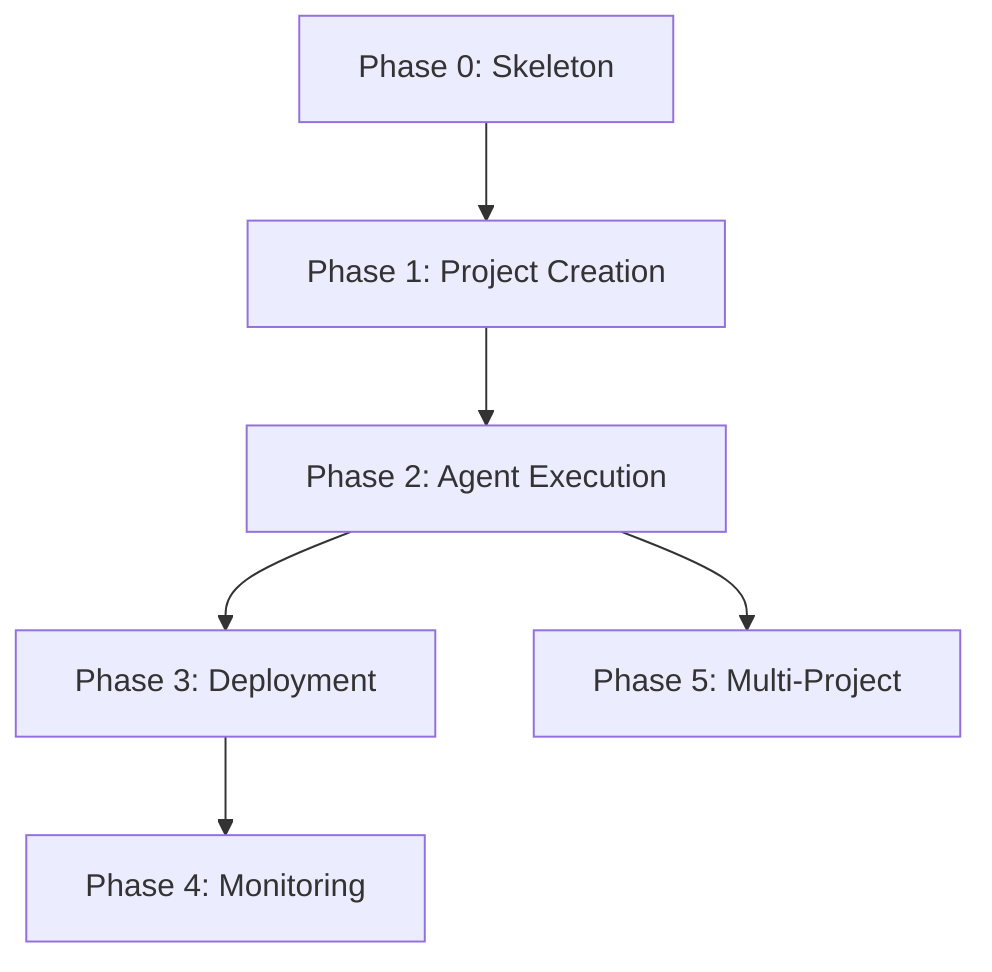

# PLAN — AutEng HQ

## Current State

Next.js 16 app scaffolded in `hq/` via `shadcn@latest init` (radix-maia style, taupe base). Tailwind v4 with OKLch tokens, shadcn v4, React 19, TypeScript strict. Button component, theme provider with dark mode, `cn()` utility, fonts (Roboto sans, Geist Mono), ESLint + Prettier configured. No Electron shell, no database, no dashboard UI, no backend services.

## Future State

See [ARCH.md](./ARCH.md) — a fully functioning Electron + Next.js desktop app distributable as .dmg, with mobile companion app, managing multiple agent-operated businesses.

## Version: v0 (MVP)

### Phase 0 — Skeleton

**From**: Bare Next.js + shadcn scaffold in `hq/`
**To**: Bootable Electron + Next.js app with empty dashboard

| Task | Description |
|------|-------------|
| 0.1 | Move `hq/` → `apps/hq/`, add Turborepo config at root, `packages/shared/` stub |
| 0.2 | Electron shell wrapping the Next.js app (electron-builder) |
| 0.3 | Build pipeline: dev (hot reload) and production (.dmg) |
| 0.4 | Add L3 semantic status tokens to `globals.css` (see DESIGN_SYSTEM.md) |
| 0.5 | Add shadcn components needed for shell: Sidebar, Card, Badge, Input, Separator, Tooltip, Avatar, Skeleton |
| 0.6 | Dashboard shell layout with sidebar navigation (projects, agents, deploys, settings) |
| 0.7 | Component registry (`components/registry/`) with types, entries, helpers, demo-map |
| 0.8 | Design system route (`/design-system`) with token browser and component gallery (dev-only) |
| 0.9 | SQLite database initialized with schema from ARCH.md (Drizzle ORM) |
| 0.10 | API route scaffolding (`app/api/`) for projects, agents, deploys |

**Exit Criteria**: App launches locally. Build produces a working .dmg. SQLite DB created on first launch.

**Feedback**: Reconcile docs against actual skeleton. Update ARCH.md if tech stack decisions changed during setup.

---

### Phase 1 — Project Creation

**From**: Empty dashboard
**To**: User can create projects from a prompt with auto-generated workflow docs

| Task | Description |
|------|-------------|
| 1.1 | "New Project" UI: prompt input form (modal or dedicated page) |
| 1.2 | Project record creation in DB via API route |
| 1.3 | Doc Generator: prompt → VISION, ARCH, PLAN, TAXONOMY, CODING-STANDARDS for the new project (via Claude API) |
| 1.4 | Local workspace creation (`git init`) with generated docs committed |
| 1.5 | Project list view on dashboard with status badges |
| 1.6 | Project detail view showing generated docs, status, and phase breakdown |

**Exit Criteria**: Prompt → project with 5 docs → visible in dashboard → workspace on disk as git repo.

**Feedback**: Validate doc generation quality. Update ARCH.md if Doc Generator component boundaries shifted.

---

### Phase 2 — Agent Execution

**From**: Projects exist but nothing is built
**To**: Dev agents implement project phases autonomously

| Task | Description |
|------|-------------|
| 2.1 | Agent Manager: spawn Claude Code / Codex CLI as child processes |
| 2.2 | Feed project docs as context to agent |
| 2.3 | Capture stdout/stderr in real-time, stream to UI via SSE |
| 2.4 | Store agent task records in DB (see ARCH: `agent_tasks`) |
| 2.5 | Agent Monitor view: live output, status, history |
| 2.6 | Phase progression with user approval gate |

**Exit Criteria**: HQ spawns agents, streams output to UI, records tasks in DB. User approves phase completion before next phase starts.

**Feedback**: Refine agent spawning patterns. Update ARCH.md with any IPC mechanisms discovered. Update TAXONOMY.md if new agent statuses emerged.

---

### Phase 3 — Deployment

**From**: Code built by agents, sitting locally
**To**: Projects deployed to cloud with tracked history

| Task | Description |
|------|-------------|
| 3.1 | Deploy Manager: Vercel integration (CLI or API) |
| 3.2 | Manual or automatic deploy trigger on phase completion |
| 3.3 | Deploy status tracking and URL capture |
| 3.4 | Deploy events stored in DB (see ARCH: `deploy_events`) |
| 3.5 | Deploy history view in project detail |

**Exit Criteria**: One-click deploy to Vercel from HQ. Deploy URL and history visible in dashboard.

**Feedback**: Validate deploy flow against ARCH.md sequence diagram. Add any new deployment platforms to TAXONOMY.md.

---

### Phase 4 — Monitoring & KPIs

**From**: Deployed but unmonitored projects
**To**: Live health and business metrics with alerting

| Task | Description |
|------|-------------|
| 4.1 | KPI Tracker: define and collect metrics per project |
| 4.2 | Platform integration for uptime/error data |
| 4.3 | Dashboard charts and trends (see ARCH: `kpi_snapshots`) |
| 4.4 | Threshold-based alerting |

**Exit Criteria**: Live KPIs on dashboard. Historical trends. Alerts on threshold breach.

**Feedback**: Review which KPIs actually matter vs. what was planned. Update VISION.md success metrics if needed.

---

### Phase 5 — Multi-Project Orchestration

**From**: Works for individual projects
**To**: Smooth management of 10+ concurrent projects

| Task | Description |
|------|-------------|
| 5.1 | Aggregate dashboard overview (cross-project stats) |
| 5.2 | Agent concurrency limits and resource management |
| 5.3 | Cross-project search, filtering, bulk actions |
| 5.4 | Performance optimization for concurrent agent processes |

**Exit Criteria**: 10 projects running concurrently without UI lag. Bulk operations work reliably.

**Feedback**: Full v0 version feedback (see WORKFLOW.md). Reconcile all docs against built system. Seed `docs/v1/` if next version is planned.

---

## Deferred to v1+

| Feature | Reason |
|---------|--------|
| Mobile companion app (React Native / Expo) | Depends on proven desktop workflows. Ship after v0 validates core loop. |
| WebSocket server (Socket.io) | Only needed for mobile real-time sync. |
| `apps/mobile/` directory | Created when mobile work begins in v1. |

## Dependency Graph

