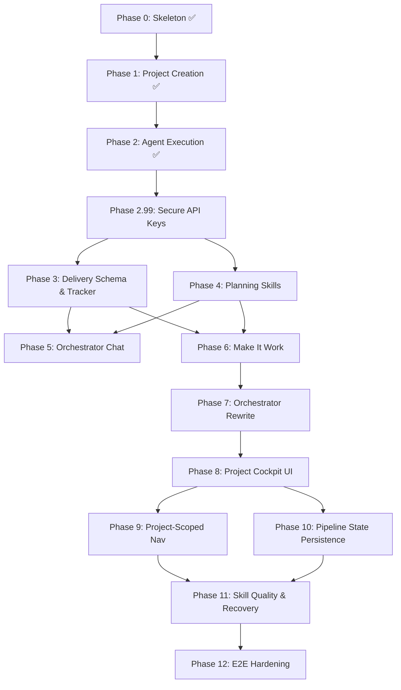

# PLAN — AutEng HQ

## Current State

Phase 8 complete. Full pipeline operational with cockpit UI:
- Phase 0–2: Skeleton, project creation, agent execution, process management
- Phase 3: Delivery schema + tracker (milestones, phases, tasks, releases with state machine)
- Phase 4: Planning skills + engine (4 skills, sequential pipeline with agent completion callbacks)
- Phase 5: Orchestrator chat (context builder, action extractor, chat UI on project page)
- Phase 6: Pipeline wired end-to-end (completion callbacks, full skill chaining, old code removed)
- Phase 7: Orchestrator rewrite (task-level agent assignment, auto-advance, phase review, arch roll-up, collaboration profiles)
- Phase 8: Project cockpit UI (three-column layout, pipeline nav, artifact viewer with markdown rendering, system messages in chat, arch/design sub-navigation, milestone tree)
- 185 unit tests + 23 Playwright E2E, TypeScript clean

Project creation → immediate redirect to cockpit → planning pipeline streams progress as system messages in always-visible chat panel → user navigates decomposition levels (vision → milestones → architecture → design → tasks) via pipeline nav bar → artifacts render as markdown with sub-navigation for arch deltas and design docs → milestone tree shows delivery status with inline controls.

## Future State

See [ARCH.md](./ARCH.md) — a fully functioning Electron + Next.js desktop app that deterministically decomposes product visions into milestones, architecture, design, and tasks, then orchestrates AI agents to build a mid-sized SaaS locally end-to-end.

## Version: v0 — Build a Mid-Sized SaaS Locally End-to-End

**Milestone**: Given a product vision, HQ decomposes it through 5 levels (vision → milestones → architecture → design → tasks), executes all tasks via AI agents, and produces a working, tested application locally. No deployment, no monitoring — just deterministic decomposition and local build.

### Phase 0 — Skeleton ✅

**From**: Bare Next.js + shadcn scaffold in `hq/`
**To**: Bootable Electron + Next.js app with empty dashboard

| Task | Description |
|------|-------------|
| 0.1 | Move `hq/` → `apps/hq/`, add Turborepo config at root, `packages/shared/` stub |
| 0.2 | Electron shell wrapping the Next.js app (electron-builder) |
| 0.3 | Build pipeline: dev (hot reload) and production (.dmg) |
| 0.4 | Add L3 semantic status tokens to `globals.css` (see DESIGN_SYSTEM.md) |
| 0.5 | Add shadcn components needed for shell: Sidebar, Card, Badge, Input, Separator, Tooltip, Avatar, Skeleton |
| 0.6 | Dashboard shell layout with sidebar navigation (projects, agents, deploys, settings) |
| 0.7 | Component registry (`components/registry/`) with types, entries, helpers, demo-map |
| 0.8 | Design system route (`/design-system`) with token browser and component gallery (dev-only) |
| 0.9 | SQLite database initialized with schema from ARCH.md (Drizzle ORM) |
| 0.10 | API route scaffolding (`app/api/`) for projects, agents, deploys |

**Exit Criteria**: App launches locally. Build produces a working .dmg. SQLite DB created on first launch.

**Feedback**: Reconcile docs against actual skeleton. Update ARCH.md if tech stack decisions changed during setup.

---

### Phase 1 — Project Creation ✅

**From**: Empty dashboard, no projects
**To**: User creates projects from a prompt, gets auto-generated workflow docs, sees them in dashboard

| Task | Description |
|------|-------------|
| 1.1 | "New Project" UI: prompt input form (dedicated page) |
| 1.2 | Project CRUD API with Zod validation |
| 1.3 | Doc Generator: prompt → VISION, ARCH, PLAN, TAXONOMY, CODING_STANDARDS (via Claude API) |
| 1.4 | Local workspace creation (`git init`, CLAUDE.md generation) |
| 1.5 | Project list view on dashboard with status badges |
| 1.6 | Project detail view showing generated docs, status, and phase breakdown |

**Exit Criteria**: Prompt → project with 5 docs + CLAUDE.md → git repo on disk → visible in dashboard → project detail shows rendered docs.

**Feedback**: Validate doc generation quality. Update ARCH.md if Doc Generator component boundaries shifted.

#### Detailed Breakdown

##### 1.1 — New Project UI

| Detail | Description |
|--------|-------------|
| **What** | "New Project" page or modal with prompt input |
| **UI** | Full-page form: project name (auto-suggested from prompt), prompt textarea, model selector (sonnet/opus/haiku), "Create" button |
| **Route** | `/projects/new` (dedicated page, not modal — room for future expansion) |
| **Components** | Form using shadcn Input, Textarea, Select, Button. Validation: prompt required, min 20 chars |
| **State** | Client-side form state. On submit → POST `/api/projects` |

##### 1.2 — Project DB + API

| Detail | Description |
|--------|-------------|
| **What** | CRUD API for projects |
| **POST `/api/projects`** | Create project record (status: `draft`), return project ID |
| **GET `/api/projects`** | List all projects (existing scaffold, add filtering by status) |
| **GET `/api/projects/:id`** | Single project with phases |
| **PATCH `/api/projects/:id`** | Update status, name, deploy_url |
| **DELETE `/api/projects/:id`** | Soft delete (status → `archived`) |
| **Validation** | Zod schemas for request bodies |

##### 1.3 — Doc Generator

| Detail | Description |
|--------|-------------|
| **What** | Transform user prompt into 5 workflow docs for the new project |
| **Input** | Project prompt + name |
| **Output** | VISION.md, ARCH.md, PLAN.md, TAXONOMY.md, CODING_STANDARDS.md |
| **Implementation** | `lib/services/doc-generator.ts` — calls Claude API (`@anthropic-ai/sdk`) with structured prompts |
| **Model** | User-selected (default: sonnet). Each doc generated as a separate API call for quality |
| **Prompt strategy** | System prompt defines the doc format/structure (derived from our own docs as templates). User prompt provides the product idea. Chain: VISION first → feed into ARCH → feed into PLAN → TAXONOMY and CODING_STANDARDS in parallel |
| **Error handling** | Retry once on failure. Store partial results. User can regenerate individual docs |
| **Status flow** | Project `draft` → `planning` (during generation) → `planning` (complete, ready for build) |

##### 1.4 — Workspace Creation

| Detail | Description |
|--------|-------------|
| **What** | Create local git repo for the project with generated docs |
| **Path** | Configurable base directory (default: `~/auteng-projects/<project-slug>/`) |
| **Steps** | 1. Create directory. 2. `git init`. 3. Write generated docs to `docs/`. 4. Generate `CLAUDE.md` at repo root (project-specific instructions for agents). 5. `git add . && git commit -m "init: generated workflow docs"` |
| **CLAUDE.md generation** | Auto-generated from project docs — includes project name, tech stack (from ARCH), coding standards summary, doc read order. This is what agents load via `settingSources: ['project']` |
| **DB update** | Set `projects.workspace_path` to the created directory |

##### 1.5 — Project List View

| Detail | Description |
|--------|-------------|
| **What** | Dashboard showing all projects with status |
| **Route** | `/projects` (update existing stub) |
| **UI** | Card grid or table. Each card: project name, status badge, prompt preview (truncated), created date, workspace path. Click → project detail |
| **Data** | GET `/api/projects` with client-side SWR or React Query |
| **Empty state** | "No projects yet" with prominent "New Project" CTA |
| **Filtering** | Status filter tabs: All, Active, Deployed, Archived |

##### 1.6 — Project Detail View

| Detail | Description |
|--------|-------------|
| **What** | Single project view showing docs, status, and phase breakdown |
| **Route** | `/projects/:id` |
| **Sections** | Header (name, status badge, actions), Docs tab (rendered markdown for each generated doc), Phases tab (from project's PLAN.md, parsed), Agents tab (placeholder for Phase 2), Deploys tab (placeholder for Phase 3) |
| **Actions** | "Start Build" button (triggers Phase 2 agent execution — wired in Phase 2), "Edit Prompt" (regenerate docs), "Archive" |

---

### Phase 2 — Agent Execution ✅

**From**: Projects exist with generated docs but nothing is built
**To**: HQ spawns multiple Claude agents per project, streams output to UI, manages background processes (dev servers, test watchers, build watchers), records everything in DB

**Key architecture decision**: Use `@anthropic-ai/claude-agent-sdk` for agent instances. See [ARCH.md](./ARCH.md) Process Management section.

| Task | Description |
|------|-------------|
| 2.1 | Install `@anthropic-ai/claude-agent-sdk`, `zod`, `uuid` |
| 2.2 | Schema migration: `background_processes` table, `agent_runs` additions, `process_configs` table |
| 2.3 | ProcessRegistry singleton (globalThis, concurrency limits, EventEmitter) |
| 2.4 | RingBuffer (500-line circular buffer) + shared process types |
| 2.5 | BackgroundProcessManager (dev_server, test_watcher, build_watcher) |
| 2.6 | HQ MCP Server via `createSdkMcpServer()` |
| 2.7 | AgentManager (SDK `query()` wrapper — spawn, cancel, resume, stream) |
| 2.8 | Output accumulator (batched DB writes every 5s or 50 messages) |
| 2.9 | Agent API routes: spawn, cancel, stream (SSE), resume |
| 2.10 | Background process API routes: start, stop, output |
| 2.11 | Agent Monitor UI (live output, status badges, cancel/resume) |
| 2.12 | Orchestrator: phase progression + user approval gates |
| 2.13 | Electron before-quit cleanup (`ProcessRegistry.shutdownAll()`) |

**Exit Criteria**: HQ spawns Claude agents via SDK, streams output to UI in real-time, records runs in DB. Background processes (dev server, test watcher, build watcher) managed with ring-buffered output. Agents pull background output via MCP tools. User approves phase transitions. All processes cleaned up on app quit.

**Feedback**: Refine agent spawning patterns. Update ARCH.md with any IPC mechanisms discovered. Update TAXONOMY.md if new agent statuses emerged.

#### Detailed Breakdown

##### 2.1 — Dependencies

| Detail | Description |
|--------|-------------|
| **What** | Install agent SDK and supporting packages |
| **Packages** | `@anthropic-ai/claude-agent-sdk`, `zod` (MCP tool schemas), `uuid` (process IDs) |
| **Command** | `pnpm --filter auteng-hq add @anthropic-ai/claude-agent-sdk zod uuid` |

##### 2.2 — Schema Migration

| Detail | Description |
|--------|-------------|
| **What** | Update DB schema for multi-agent support and background processes |
| **`agent_runs` table** (rename from `agentTasks`) | Add: `project_id` (FK, not null), make `phase_id` nullable, add `session_id`, `model`, `prompt`, `cost_usd`, `turn_count`, `max_turns`, `budget_usd` |
| **New: `background_processes` table** | `id`, `project_id` (FK), `process_type` (dev_server/test_watcher/build_watcher/custom), `command`, `args` (JSON), `status`, `port`, `url`, `started_at`, `stopped_at` |
| **New: `process_configs` table** | `id`, `project_id` (FK, nullable = global default), `max_agents`, `max_background`, `default_model`, `default_max_turns`, `default_budget_usd`, `created_at`, `updated_at` |
| **Migration** | `npx drizzle-kit generate && npx drizzle-kit push` |

##### 2.3 — ProcessRegistry Singleton

| Detail | Description |
|--------|-------------|
| **What** | Central in-memory registry of all running processes |
| **File** | `lib/process/process-registry.ts` |
| **Pattern** | Singleton on `globalThis[Symbol.for("auteng.processRegistry")]` (survives Next.js hot reload) |
| **Interface** | `register(process)`, `unregister(id)`, `getByProject(projectId)`, `getByType(type)`, `getAll()`, `count()`, `countByProject(projectId)` |
| **Events** | `EventEmitter`: `process:started`, `process:stopped`, `process:failed`, `process:output` |
| **Concurrency** | Checks limits on `register()`. Throws `ConcurrencyLimitError` if exceeded. Defaults: 15 global, 5 agents/project, 3 background/project |
| **Managed process shape** | `{ id, projectId, type: "agent" | "background", pid, status, startedAt, meta }` |

##### 2.4 — RingBuffer + Shared Types

| Detail | Description |
|--------|-------------|
| **What** | Fixed-size circular buffer for background process output + shared type definitions |
| **Files** | `lib/process/ring-buffer.ts`, `lib/process/types.ts` |
| **RingBuffer** | 500-line capacity (configurable). Methods: `push(line)`, `getAll()`, `getLast(n)`, `clear()`. Stores `{ timestamp, stream: "stdout" | "stderr", line }` |
| **Types** | `ManagedProcess`, `AgentInstance`, `BackgroundProcess`, `ProcessType`, `AgentConfig`, `ConcurrencyLimits` |

##### 2.5 — BackgroundProcessManager

| Detail | Description |
|--------|-------------|
| **What** | Manages long-lived support processes |
| **File** | `lib/process/background-process-manager.ts` |
| **Process types** | `dev_server` (next dev, vite dev, etc.), `test_watcher` (vitest --watch, jest --watch), `build_watcher` (tsc --watch) |
| **Spawn** | `child_process.spawn(command, args, { cwd, stdio: 'pipe' })`. Pipes stdout/stderr to RingBuffer |
| **Health checks** | Dev servers: poll health URL every 10s. All: monitor `exit` event |
| **Port detection** | For dev servers: parse stdout for "localhost:NNNN" pattern, record port |
| **Shutdown** | SIGTERM → 5s wait → SIGINT → 3s wait → SIGKILL. Graceful cascade |
| **DB** | Create/update `background_processes` records on start/stop/fail |
| **Key methods** | `start(projectId, processType, command, args, cwd)`, `stop(processId)`, `stopAllForProject(projectId)`, `getOutput(processId, lines?)`, `getDevServerUrl(projectId)` |

##### 2.6 — HQ MCP Server

| Detail | Description |
|--------|-------------|
| **What** | In-process MCP server injected into every agent via SDK's `mcpServers` option |
| **File** | `lib/process/hq-mcp-server.ts` |
| **Implementation** | `createSdkMcpServer()` from `@anthropic-ai/claude-agent-sdk` |
| **Tools** | `get_process_output(projectId, processType?, lines?)` — ring buffer content. `get_dev_server_url(projectId)` — URL string. `get_process_status(projectId)` — all background process statuses. `start_process(processType, command, args)` — start a background process. `stop_process(projectId, processType?)` — stop background processes |
| **Schemas** | Defined with `zod` for type safety |
| **Purpose** | Agents pull dev server output on demand (capped, filtered). No context explosion. Agents can also manage their own dev servers |

##### 2.7 — AgentManager

| Detail | Description |
|--------|-------------|
| **What** | Wraps Claude Agent SDK `query()` for spawning and managing agent instances |
| **File** | `lib/process/agent-manager.ts` |
| **Spawn flow** | 1. Check concurrency via ProcessRegistry. 2. Create `agent_runs` DB record (status: `queued`). 3. Create AbortController. 4. Call `query({ prompt, options })`. 5. Register with ProcessRegistry. 6. Update DB → `running`. 7. Consume AsyncGenerator in background loop. 8. On completion → update DB → `completed`/`failed`, unregister |
| **SDK options** | `cwd`: project workspace. `permissionMode: 'bypassPermissions'`. `model`: from config. `maxTurns`, `maxBudgetUsd`: from config. `mcpServers`: HQ MCP server. `settingSources: ['project']`: loads project CLAUDE.md |
| **Stream** | `streamOutput(agentId)` returns `ReadableStream` for SSE. Each `SDKMessage` forwarded to stream |
| **Cancel** | `cancel(agentId)` → `abortController.abort()`. DB → `cancelled`. Unregister |
| **Resume** | `resume(agentId)` → `query({ prompt, options: { resume: sessionId } })`. Re-register |
| **Key methods** | `spawn(projectId, prompt, config?)`, `cancel(agentId)`, `resume(agentId)`, `streamOutput(agentId)`, `getStatus(agentId)`, `listByProject(projectId)` |

##### 2.8 — Output Accumulator

| Detail | Description |
|--------|-------------|
| **What** | Batched DB writes for agent output (avoid per-token writes) |
| **File** | `lib/process/output-accumulator.ts` |
| **Strategy** | Accumulate `SDKMessage[]` in memory. Flush to `agent_runs.output` every 5 seconds or every 50 messages (whichever first). Final flush on completion/failure |
| **Format** | JSON array of messages stored in `output` column. Enables replay in UI |

##### 2.9 — Agent API Routes

| Detail | Description |
|--------|-------------|
| **What** | HTTP endpoints for agent lifecycle |
| **POST `/api/agents`** | Spawn agent. Body: `{ projectId, prompt, phaseId?, model?, maxTurns?, maxBudgetUsd? }`. Returns `{ agentId }` |
| **GET `/api/agents`** | List agents. Query params: `projectId`, `status`. Returns agent records from DB |
| **GET `/api/agents/:id`** | Agent status + metadata |
| **DELETE `/api/agents/:id`** | Cancel running agent |
| **GET `/api/agents/:id/stream`** | SSE endpoint. `Content-Type: text/event-stream`. Streams `SDKMessage` events. Closes on completion |
| **POST `/api/agents/:id/resume`** | Resume a stopped/failed agent session |

##### 2.10 — Background Process API Routes

| Detail | Description |
|--------|-------------|
| **What** | HTTP endpoints for background process management |
| **POST `/api/processes`** | Start background process. Body: `{ projectId, processType, command, args }` |
| **GET `/api/processes`** | List processes. Query params: `projectId`, `processType` |
| **GET `/api/processes/:id`** | Process status |
| **DELETE `/api/processes/:id`** | Stop process |
| **GET `/api/processes/:id/output`** | Ring buffer content. Query params: `lines` (default 50) |

##### 2.11 — Agent Monitor UI

| Detail | Description |
|--------|-------------|
| **What** | Live view of running agents and their output |
| **Route** | `/agents` (update existing stub) + `/projects/:id` agents tab |
| **Components** | Agent card (status badge, project name, prompt, model, cost, turns). Output panel (streaming terminal-like view consuming SSE). Controls (cancel, resume buttons) |
| **Project view** | Agents tab shows all agents for that project. Background processes section shows dev server/watcher status with recent output |
| **Real-time** | `EventSource` consuming `/api/agents/:id/stream`. Auto-scroll with pause on manual scroll |

##### 2.12 — Orchestrator

| Detail | Description |
|--------|-------------|
| **What** | Phase sequencing and approval gates |
| **File** | `lib/services/orchestrator.ts` |
| **Phase flow** | `pending` → user clicks "Start" → spawn agent(s) → `active` → agent completes → `review` → user approves → `completed` → next phase |
| **Approval gate** | UI prompt between phases. User can approve, reject (re-run), or skip |
| **Multi-agent** | Orchestrator can spawn multiple agents for a single phase (e.g., one for frontend, one for backend) |
| **Integration** | Calls AgentManager.spawn() with phase-specific prompts derived from project's PLAN.md |

##### 2.13 — Electron Cleanup

| Detail | Description |
|--------|-------------|
| **What** | Clean shutdown of all processes on app quit |
| **File** | Update `electron/main.ts` |
| **Implementation** | On `app.on('before-quit')`: call ProcessRegistry `shutdownAll()` which stops all background processes (graceful cascade) and cancels all agent instances (AbortController). Wait up to 10s for cleanup before force-quitting |

---

### Phase 2.99 — Secure API Key Management

**From**: API key required but only configurable via env var (unusable in distributed desktop app)
**To**: Users enter their API key in Settings, encrypted at rest via OS keychain master key

**Detailed design**: [docs/v0/ph2/99_SECURE_API_KEYS_DETAILED_DESIGN.md](./v0/ph2/99_SECURE_API_KEYS_DETAILED_DESIGN.md)

| Task | Description |
|------|-------------|
| 2.99.1 | `app_settings` table (key/value + encrypted flag) in schema + SCHEMA_SQL |
| 2.99.2 | `lib/services/secrets.ts`: AES-256-GCM encrypt/decrypt using master key, settings CRUD, `getAnthropicApiKey()` with env fallback |
| 2.99.3 | Electron master key: generate on first launch, encrypt with `safeStorage`, store in `master.key` file, pass as `HQ_MASTER_KEY` env to Next.js |
| 2.99.4 | `/api/settings` route: GET (masked key + status), PUT (validate + save via secrets service) |
| 2.99.5 | Settings page UI: API key input with show/hide, save button, configured/unconfigured badge, encryption status |
| 2.99.6 | Update `doc-generator.ts` to accept `apiKey` param; update generate endpoint to read from secrets service |
| 2.99.7 | Tests: encrypt/decrypt roundtrip, settings CRUD, env fallback, API route, generate endpoint integration |

**Exit Criteria**: User enters API key in Settings → key encrypted in SQLite → Generate Docs uses saved key → clear error if no key configured → Electron build encrypts via OS keychain. Dev mode falls back to env var.

**Feedback**: Validate encryption works across macOS/Windows/Linux. Update ARCH.md with secrets architecture.

---

### Phase 3 — Delivery Schema & Tracker

**From**: Phases parsed from PLAN.md at runtime, no milestones or tasks in DB
**To**: Full delivery-side data model in SQLite with milestone/phase/task/release entities and a state machine for progression

| Task | Description |
|------|-------------|
| 3.1 | Schema migration: add `milestones`, `phases`, `tasks`, `releases`, `release_milestones` tables (see ARCH.md ERD) |
| 3.2 | Add `vision_hypothesis` and `success_metric` columns to `projects` |
| 3.3 | Add `task_id` FK (nullable) to `agent_runs`, deprecate `phase_label` |
| 3.4 | Delivery Tracker service: `lib/services/delivery-tracker.ts` — state machine for milestone/phase/task status transitions |
| 3.5 | Task extraction: parse design docs → create task records in DB, linked to phases and source doc |
| 3.6 | Milestone completion detection: all phases complete → milestone status → `completed` |
| 3.7 | Release stamping: create release record with semver, link to milestones via join table |
| 3.8 | API routes: CRUD for milestones, phases, tasks, releases (`/api/projects/:id/milestones`, etc.) |
| 3.9 | Update orchestrator to use DB-tracked tasks/phases instead of PLAN.md parsing |
| 3.10 | Tests: delivery tracker state machine, task extraction, milestone completion, release stamping |

**Exit Criteria**: Milestones, phases, tasks, and releases are DB entities with proper status transitions. Orchestrator sequences work via delivery tracker instead of markdown parsing. Agent runs link to tasks. Releases can be stamped with semver.

**Feedback**: Validate state machine covers all edge cases (retry, skip, partial completion). Ensure TAXONOMY.md statuses match implementation.

---

### Phase 4 — Planning Skills

**From**: Doc generation is a single monolithic prompt-to-5-docs pipeline
**To**: Planning is decomposed into 4 skills (vision, milestones, architecture, design) that agents use to produce workspace files at each decomposition level

| Task | Description |
|------|-------------|
| 4.1 | Vision skill: `skills/vision/SKILL.md` — extracts hypothesis + success metric from user prompt, produces VISION.md |
| 4.2 | Milestone skill: `skills/milestones/SKILL.md` — decomposes vision into ordered milestones with MVP boundary, produces MILESTONES.md |
| 4.3 | Update architecture skill: `skills/architecture/SKILL.md` — already exists, update to work per-milestone (scope architecture to a single milestone's components) |
| 4.4 | Design skill: `skills/design/SKILL.md` — detailed design per component (interfaces, data models, error states), produces files under `docs/detailed_design/<Phase_Name>/<component>.md` |
| 4.5 | Planning Engine service: `lib/services/planning-engine.ts` — runs skills in sequence by spawning agents with skill context |
| 4.6 | Skill installer: copy skills into project workspace on project creation so agents can reference them |
| 4.7 | Update project creation flow: replace monolithic doc generator with planning engine running skills in sequence (vision → milestones → architecture → design) |
| 4.8 | Bridge: after design skill completes, extract tasks from `docs/detailed_design/*/` structure and populate delivery schema (Phase 3) |
| 4.9 | Tests: each skill produces valid output, planning engine sequences correctly, task extraction from design docs |

**Exit Criteria**: Project creation runs 4 skills in sequence, producing VISION.md, MILESTONES.md, per-milestone architecture deltas under `docs/milestones/<name>/`, and per-component detailed designs under `docs/detailed_design/<Phase_Name>/`. Tasks are extracted from the design directory structure and populated in the delivery schema. Architecture deltas are rolled up into canonical docs on milestone completion. Skills are installable and improvable independently.

**Feedback**: Evaluate quality of generated docs at each level. Compare against monolithic doc generator output. Tune skill prompts based on results.

---

### Phase 5 — Orchestrator Chat

**From**: Users interact with the orchestrator only via UI buttons (start/approve/reject/skip)
**To**: Conversational interface on the project page for querying status, controlling the pipeline, and approving milestones

| Task | Description |
|------|-------------|
| 5.1 | Chat API route: `POST /api/projects/:id/chat` — Claude API call with project state as context (milestones, tasks, recent agent outputs, workspace docs) |
| 5.2 | Chat message persistence: store conversation history per project (new `chat_messages` table or append to existing) |
| 5.3 | Context builder: assemble project state into system prompt — milestone statuses, active tasks, recent failures, workspace file listing |
| 5.4 | Action extraction: parse chat responses for orchestrator actions (start task, skip milestone, retry, re-plan) and execute them |
| 5.5 | Chat UI component on project page: message list, input, streaming responses, action confirmation prompts |
| 5.6 | SSE streaming for chat responses (reuse existing SSE infrastructure) |
| 5.7 | Tests: context builder, action extraction, chat API route |

**Exit Criteria**: User can chat with the orchestrator on any project page. Chat understands project state (milestones, tasks, failures). User can ask questions ("why did task X fail?", "what's blocking M2?") and issue commands ("start the next milestone", "skip this task", "re-run the architecture skill for M2") conversationally. Actions require confirmation before execution.

**Feedback**: Evaluate chat quality — does it understand project state accurately? Are action extractions reliable? Tune context builder to include the right amount of state without overwhelming the context window.

---

### Phase 6 — Make It Work

**From**: All components built (skills, delivery tracker, chat, agent execution) but not connected end-to-end. New project creation calls `/plan` which only spawns vision skill. No completion callbacks. Old doc generator removed from flow but nothing replaced it.
**To**: A user creates a project and the full planning pipeline runs to completion, populating the delivery schema. User can then start tasks and see agents execute.

| Task | Description |
|------|-------------|
| 6.1 | Agent completion callbacks: add `onComplete(agentId, success)` callback to AgentManager. Called from `finishAgent()`. Planning engine and orchestrator register callbacks to drive the pipeline forward |
| 6.2 | Full pipeline chaining: `PlanningEngine.runPipeline()` runs vision → waits → milestones → waits → architecture (per milestone) → design (per component) → task extraction, using completion callbacks |
| 6.3 | Remove old doc generator: delete `doc-generator.ts`, `/generate` route, and all references. The planning engine is the only path |
| 6.4 | Remove old orchestrator PLAN.md parsing: delete `phase-parser.ts`, remove PLAN.md parsing from orchestrator. Phases come from the delivery tracker only |
| 6.5 | Workspace creation update: `createWorkspace()` no longer needs generated docs — just creates the directory, `git init`, installs skills, generates CLAUDE.md stub. Planning engine populates docs |
| 6.6 | Project detail page: show planning progress when status is `planning`, show milestone/phase/task tree when status is `building`, remove old phases tab that reads PLAN.md |
| 6.7 | Agent spawn error visibility: if `spawn()` fails, update `agent_runs` status to `failed` with error message. Show in UI |
| 6.8 | Resume agent API key fix: `AgentManager.resume()` must retrieve and set API key before calling `query()` |
| 6.9 | Smoke test: create a project, verify full pipeline runs, verify milestones/phases/tasks appear in DB and UI |

**Exit Criteria**: User creates a project with a vision prompt → planning pipeline runs all 4 skills to completion → milestones, phases, and tasks populated in DB → project detail shows milestone tree → user can start a task → agent spawns and runs → agent output streams to UI. No dead code from old approaches.

**Feedback**: Does the pipeline complete reliably? How long does it take? Do the generated docs make sense? Are agent spawn errors visible?

---

### Phase 7 — Orchestrator Rewrite

**From**: Orchestrator uses PLAN.md parsing and phase-label strings. Planning engine and delivery tracker are separate systems
**To**: Single orchestrator drives both planning and delivery through the delivery tracker, with task-level agent assignment

| Task | Description |
|------|-------------|
| 7.1 | Rewrite `orchestrator.ts` to use DeliveryTracker for all state management (no more PLAN.md parsing) |
| 7.2 | Task-level agent assignment: orchestrator assigns agents to individual tasks (not phases), builds task-level prompts with milestone/phase/design doc context |
| 7.3 | Phase completion detection: when all tasks in a phase complete, orchestrator triggers phase review agent |
| 7.4 | Milestone completion detection: when all phases complete, orchestrator marks milestone complete and triggers arch roll-up |
| 7.5 | Collaboration profile integration: orchestrator pauses at the appropriate levels based on the project's collaboration profile |
| 7.6 | Update all API routes to use new orchestrator (milestones PATCH actions delegate to orchestrator) |
| 7.7 | Tests: orchestrator integration with delivery tracker, task-level spawning, phase review triggering |

**Exit Criteria**: Single orchestrator manages the full lifecycle. Tasks are assigned to agents individually. Phase completion triggers automated review. Milestone completion triggers arch roll-up. Collaboration profiles work.

---

### Phase 8 — Project Cockpit UI

**From**: Project page uses tabbed layout with separate pages for docs, milestones, agents, chat. Chat hidden in a tab. Planning feedback stuck on create form. Sidebar pushes content off-screen.
**To**: Three-column cockpit layout: sidebar, center content (active artifact with pipeline nav), always-visible chat panel. Project creation redirects immediately. Pipeline progress appears as system messages in chat.

| Task | Description |
|------|-------------|
| 8.1 | Three-column layout: sidebar (existing) + center content (flex-grow) + chat panel (fixed 350px right). Fix sidebar overflow bug |
| 8.2 | Pipeline progress bar: horizontal nav at top of center column showing Vision → Milestones → Architecture → Design → Tasks. Clickable — shows artifact for that level |
| 8.3 | Center content renderer: renders the active artifact as markdown with mermaid diagrams. Changes based on pipeline level selection |
| 8.4 | Chat panel always visible: move chat from tab to fixed right panel. Add system message type for pipeline events (visually distinct from user/assistant messages) |
| 8.5 | Project creation redirect: form creates project then immediately redirects to project page. Planning pipeline runs in background, progress appears as system messages in chat |
| 8.6 | Milestone/phase/task tree as the "Tasks" level: collapsible tree with status icons, inline start/retry/skip controls |
| 8.7 | Sub-navigation for Architecture and Design levels: milestone selector for arch docs, phase → component selector for design docs |
| 8.8 | Update E2E tests for new layout |

**Exit Criteria**: User creates a project → lands on project cockpit → pipeline progress streams in chat panel → user can click pipeline levels to view artifacts → chat is always visible for interaction → milestone tree shows delivery status with inline controls. Sidebar doesn't push content off-screen.

---

### Phase 9 — Project-Scoped Navigation

**Detailed design**: [docs/v0/ph9/INFORMATION_ARCHITECTURE.md](./v0/ph9/INFORMATION_ARCHITECTURE.md)

**From**: Sidebar shows the same 4 top-level links (Dashboard, Projects, Agents, Deploys) regardless of context. Selecting a project doesn't change the nav. Agents page shows all agents globally. No indicator of which project the user is working in.
**To**: Once a user enters a project, the sidebar transitions to project-scoped navigation. A project header shows which project is active. Agents, deploys, and other views filter to that project. Global nav remains accessible via a back/home action.

| Task | Description |
|------|-------------|
| 9.1 | Project context indicator: when viewing a project, sidebar header shows project name + status badge with a back button to return to the global project list |
| 9.2 | Project-scoped sidebar nav: replace top-level nav items with project-relevant sections (Cockpit, Agents, Deploys, Settings) when inside a project. Each links to `/projects/:id/<section>` |
| 9.3 | Project-scoped agents view: `/projects/:id/agents` shows agents filtered to that project, reusing the existing agent list/detail components |
| 9.4 | Project-scoped deploys view: `/projects/:id/deploys` shows deploys filtered to that project |
| 9.5 | Global nav fallback: top-level `/agents` and `/deploys` routes remain but show cross-project views with a project column for context |
| 9.6 | Update E2E tests for new navigation structure |

**Exit Criteria**: User selects a project → sidebar switches to project-scoped nav with project name visible → Agents/Deploys filter to that project → user can navigate back to global project list. Global routes still work for cross-project views.

**Feedback**: Does the nav feel natural? Is the project context always clear? Can users switch projects without getting lost?

#### User Flow

1. User launches app → lands on **Dashboard** (global view)
2. User clicks a project in the list → navigates to `/projects/:id` → sidebar transitions to project-scoped nav
3. User works within the project (cockpit, agents, deploys) — sidebar always shows project context
4. User clicks back/home in sidebar → returns to global Dashboard → sidebar reverts to global nav
5. User can also go to global `/agents` or `/deploys` for cross-project views from the global nav

#### Information Architecture by Page

**Global Dashboard (`/`)**
- Sidebar: Dashboard, Projects, Agents, Deploys, Settings
- Content: Project list with status badges, quick stats, recent activity
- Action: Click project → enter project scope

**Global Projects (`/projects`)**
- Sidebar: Same global nav
- Content: Full project list with filters (status, search)
- Action: Click project → enter project scope. "New Project" button → `/projects/new`

**Global Agents (`/agents`)**
- Sidebar: Same global nav
- Content: All agents across all projects, with project name column for context
- Use case: "What's running right now?" across everything

**Global Deploys (`/deploys`)**
- Sidebar: Same global nav
- Content: All deploys across all projects, with project name column

**Project Cockpit (`/projects/:id`)**
- Sidebar: Project header (name + status + back button), then: Cockpit, Agents, Deploys
- Content: Three-column cockpit (pipeline nav + artifact viewer + chat panel)
- This is the main working view for a project

**Project Agents (`/projects/:id/agents`)**
- Sidebar: Same project-scoped nav
- Content: Agents filtered to this project. Agent cards with status, output streaming, cancel/resume
- No project name column needed (implicit from context)

**Project Deploys (`/projects/:id/deploys`)**
- Sidebar: Same project-scoped nav
- Content: Deploys filtered to this project

**Settings (`/settings`)**
- Sidebar: Always accessible (global nav and project nav both show it)
- Content: API key management, app preferences

---

### Phase 10 — Pipeline State Persistence

**From**: Pipeline gate buttons (e.g. "progress to next stage" after vision completes) disappear on page refresh. UI state relies on in-memory component state rather than DB-backed status. Unclear if other transient states have the same problem.
**To**: All pipeline progress, gate states, and user actions survive page refresh. The UI reconstructs its full state from the database on load.

| Task | Description |
|------|-------------|
| 10.1 | Audit pipeline UI state: walk through the full flow (project creation → vision → milestones → architecture → design → tasks) and document every place where UI state is lost on refresh |
| 10.2 | Persist gate states: ensure skill completion status and "ready to advance" flags are stored in DB (delivery tracker or agent_runs) so the UI can reconstruct gate buttons on reload |
| 10.3 | Persist active pipeline level: store the user's selected pipeline level per project so refreshing the cockpit returns to the same view |
| 10.4 | Chat message persistence: verify system messages (pipeline events) and user/assistant messages survive refresh. Fix any gaps |
| 10.5 | Agent run status reconciliation: on page load, reconcile in-memory agent state with DB — detect agents that were running when the app restarted and mark them appropriately |
| 10.6 | Smoke test: full pipeline walkthrough with page refreshes at every stage — verify no state loss |

**Exit Criteria**: User can refresh the page at any point during the pipeline and return to the exact same state — correct pipeline level selected, gate buttons visible, chat history intact, agent statuses accurate. No transient-only UI state for pipeline progression.

**Feedback**: Are there edge cases where state reconstruction feels wrong (e.g. stale "running" indicators)? Does the app feel solid on refresh?

---

### Phase 11 — Skill Quality & Error Recovery

**From**: Skills produce first-draft docs, errors require manual intervention
**To**: Skills produce high-quality decomposition docs, failed tasks and phases recover gracefully

| Task | Description |
|------|-------------|
| 11.1 | Skill prompt tuning: run the pipeline on 3-5 different project prompts, evaluate output quality, iterate on skill prompts |
| 11.2 | Phase retry: failed tasks can be retried individually, failed phases roll back and re-execute |
| 11.3 | Phase review agent: implement the automated review that checks exit criteria, runs tests, reviews code changes |
| 11.4 | Fix-up loop: review failures create fix-up tasks, phase re-enters active, re-reviews on completion |
| 11.5 | CLAUDE.md generation update: workspace CLAUDE.md reflects skill-based workflow, doc read order, milestone context |

**Exit Criteria**: Pipeline produces usable decomposition for mid-complexity SaaS prompts. Failed tasks can be retried. Phase review catches common issues and generates fix-up tasks.

---

### Phase 12 — End-to-End Hardening

**From**: Pipeline runs but hasn't been stress-tested
**To**: A mid-complexity SaaS goes from prompt to locally-running application

| Task | Description |
|------|-------------|
| 12.1 | End-to-end test: "freelancer invoicing with Stripe payments" → full decomposition → agent execution → working local app |
| 12.2 | E2E Playwright tests: full pipeline from project creation through task completion |
| 12.3 | Architecture roll-up integration: milestone completion triggers canonical doc roll-up |
| 12.4 | Release stamping: milestone completion creates release records with semver |
| 12.5 | Full v0 doc reconciliation: update ARCH.md, TAXONOMY.md, PLAN.md against actual built system |

**Exit Criteria**: A mid-complexity SaaS vision goes from prompt to locally-running, tested application in <4 hours without human code intervention. All milestones, phases, and tasks tracked in DB. User can monitor and control the pipeline via dashboard and orchestrator chat.

**Feedback**: Full v0 feedback. Reconcile all docs against built system. Identify what's needed for v1.

---

## Deferred to v1+

| Feature | Reason |
|---------|--------|
| Deployment (Vercel/AWS integration, deploy manager) | v0 focuses on local build. Deploy is the next milestone after proving the decomposition pipeline works. |
| Monitoring & KPIs (health metrics, alerting, threshold tracking) | Requires deployed projects. Ship after v1 deployment works. |
| Multi-project orchestration (aggregate dashboard, cross-project search, bulk actions) | v0 proves the single-project pipeline. Multi-project is a scale concern for v1+. |
| Mobile companion app (React Native / Expo) | Depends on proven desktop workflows. Ship after v1 validates core loop. |
| WebSocket server (Socket.io) | Only needed for mobile real-time sync. |
| Release publishing (push releases to registries, package managers) | Requires deployment infrastructure. |

## Dependency Graph

