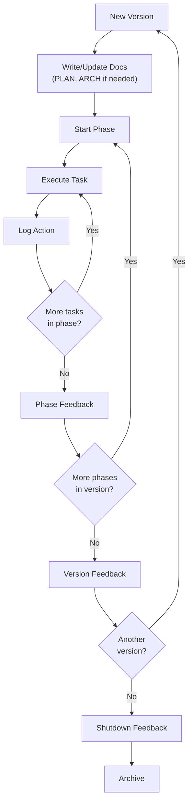

# WORKFLOW — AutEng HQ

## Principle

Everything has its place. No duplication. Each document owns a domain. When document A needs content from document B, it references — never copies.

## Work Unit Hierarchy

```
Project
  └── Version (v0 = MVP, v1, v2, ...)
        └── Phase (discrete deliverable with exit criteria)
```

This hierarchy applies to building AutEng HQ itself **and** to every project HQ manages.

- **Project**: A product/business with its own VISION, ARCH, and identity
- **Version**: A release cycle. Each version has its own docs directory, PLAN, and ARCH diff
- **Phase**: A stage within a version with defined scope and exit criteria

## Document Ownership

| Document | Owns | Does NOT Own |
|----------|------|-------------|
| VISION.md | Product scope, users, pricing, success metrics | Architecture, execution order |
| ARCH.md | System diagrams, schema, component boundaries, data flow | Implementation code, execution order, product decisions |
| PLAN.md | Current state, future state, phased transition, exit criteria | Architecture details (references ARCH), progress |
| TAXONOMY.md | Canonical names, enums, statuses, naming conventions | Definitions that belong in ARCH or VISION |
| CODING-STANDARDS.md | Quality bars, security rules, definition of done | Architecture, product scope, design tokens |
| DESIGN_SYSTEM.md | Tokens, color/spacing/typography/z-index scales, component registry, atomic levels, design system route | Component implementation, product scope |
| WORKFLOW.md | Session protocol, lifecycle, feedback process | Content of other documents |
| WORKFLOW_AUDIT.md | Append-only log of orchestrator actions (decisions, agent spawns, deploys, feedback runs) | Plan progress (that's PLAN_PROGRESS_LOG) |
| PLAN_PROGRESS_LOG.md | Append-only record of progress against the PLAN (task completion, phase transitions, discoveries) | Orchestrator decisions (that's WORKFLOW_AUDIT) |

## Directory Structure

```
project/
├── docs/                       # Current version (v0 / MVP)
│   ├── VISION.md
│   ├── ARCH.md
│   ├── PLAN.md
│   ├── TAXONOMY.md
│   ├── CODING-STANDARDS.md
│   ├── DESIGN_SYSTEM.md
│   ├── WORKFLOW.md
│   ├── WORKFLOW_AUDIT.md       # Orchestrator action log
│   └── PLAN_PROGRESS_LOG.md    # Progress against the plan
├── docs/v1/                    # Next version
│   ├── v1_VISION.md            # Only if vision changes
│   ├── v1_ARCH.md              # Architecture diff from v0
│   ├── v1_PLAN.md              # New phases for v1
│   ├── v1_PLAN_PROGRESS_LOG.md
│   └── ...
└── docs/v2/                    # And so on
```

Version docs describe **diffs from the parent version**, not full rewrites. v1_ARCH.md references the base ARCH.md and describes only what changes.

## Session Protocol

### Read Order

When starting a session (human or agent), read documents in this order:

1. **WORKFLOW.md** — How to work
2. **CODING-STANDARDS.md** — Quality rules
3. **DESIGN_SYSTEM.md** — Tokens, components, visual rules
4. **TAXONOMY.md** — Shared vocabulary
5. **ARCH.md** — System design
6. **PLAN.md** — What to build and in what order
7. **VISION.md** — Why we're building it
8. **PLAN_PROGRESS_LOG.md** — What's already done
9. **WORKFLOW_AUDIT.md** — What the orchestrator has done

### Trivial Prompt Pattern

The goal is minimal prompts. With docs loaded, a developer or agent needs only:

> "Implement Phase 2, Task 3"

The agent then:
1. Finds Phase 2 scope in PLAN.md
2. References ARCH.md for design
3. Uses TAXONOMY.md for naming
4. Applies CODING-STANDARDS.md quality rules
5. Checks PLAN_PROGRESS_LOG.md for context on prior work
6. Implements the task
7. Logs progress to PLAN_PROGRESS_LOG.md

## Development Lifecycle



## Logging

There are two append-only logs with distinct purposes.

### PLAN_PROGRESS_LOG.md — Progress Against the Plan

Records task completion, phase transitions, and discoveries made during development. This is the raw input for feedback stages.

**What to log**: Every task completed, every phase transition, every discovery.

**Format**:
```markdown
## YYYY-MM-DD

### v0 / Phase N / Task M — <short description>
- **Action**: <what was done>
- **Outcome**: <result>
- **Discovery**: <anything that needs to feed back into docs>
```

### WORKFLOW_AUDIT.md — Orchestrator Actions

Records decisions and actions taken by the orchestrator (HQ itself or the human operator). This is the audit trail for *why* things happened, not *what* was built.

**What to log**: Agent spawns, deploy triggers, phase approvals/rejections, feedback runs, configuration changes, doc updates from feedback.

**Format**:
```markdown
## YYYY-MM-DD

### <action type> — <short description>
- **Actor**: <orchestrator | user | feedback-engine>
- **Action**: <what was decided or triggered>
- **Reason**: <why>
- **Affected**: <which project/version/phase>
```

### When to Use Which

| Event | Log To |
|-------|--------|
| Task completed | PLAN_PROGRESS_LOG |
| Phase exit criteria met | PLAN_PROGRESS_LOG |
| Discovery during development | PLAN_PROGRESS_LOG |
| Agent spawned or killed | WORKFLOW_AUDIT |
| Deploy triggered | WORKFLOW_AUDIT |
| Phase approved/rejected | WORKFLOW_AUDIT |
| Feedback stage run | WORKFLOW_AUDIT |
| Doc updated from feedback | WORKFLOW_AUDIT |
| Configuration or settings changed | WORKFLOW_AUDIT |

## Feedback Stages

Feedback is the mechanism that keeps documentation accurate as reality diverges from the plan. There are three feedback triggers:

### 1. Phase Feedback (end of every phase)

**Trigger**: Phase exit criteria met (or phase failed)

**Process**:
1. Review all PLAN_PROGRESS_LOG entries for the phase
2. Collect all discoveries flagged during tasks
3. For each discovery, determine which document owns it:
   - Architecture change → update ARCH.md
   - New terminology → update TAXONOMY.md
   - Scope change → update VISION.md
   - Quality rule learned → update CODING-STANDARDS.md
   - Plan deviation → update PLAN.md (remaining phases)
4. Apply updates to the owning documents
5. Log the feedback itself to PLAN_PROGRESS_LOG.md

**Checklist**:
- [ ] All phase discoveries reviewed
- [ ] Owning documents updated
- [ ] PLAN.md remaining phases still accurate
- [ ] ARCH.md still reflects actual system
- [ ] No orphaned TODOs or undocumented decisions

### 2. Version Feedback (end of every version)

**Trigger**: All phases in the version are complete

**Process**:
1. Review the full version's PLAN_PROGRESS_LOG entries
2. Reconcile all documents against the actual built system
3. Ensure ARCH.md diagrams match deployed reality
4. Capture lessons learned
5. If a next version is planned, seed `docs/vN/` with the diff docs

**Checklist**:
- [ ] ARCH.md matches built system exactly
- [ ] PLAN.md phases all marked complete or explicitly deferred
- [ ] TAXONOMY.md reflects all terms actually used in code
- [ ] CODING-STANDARDS.md updated with any new conventions adopted
- [ ] VISION.md success metrics reviewed against actuals
- [ ] Next version docs seeded (if applicable)

### 3. Shutdown Feedback (project pause or archive)

**Trigger**: Project is being paused, archived, or handed off

**Process**:
1. Full document reconciliation (same as version feedback)
2. Document current state explicitly — what works, what doesn't, what's in progress
3. Capture handoff notes: what would someone need to know to resume this project
4. Final PLAN_PROGRESS_LOG entry summarizing project state

**Output**: A project that can be resumed by any developer or agent with zero context beyond the docs.

## Cross-Document Rules

1. **Reference, don't duplicate** — If you're writing content that exists in another doc, link to it
2. **Each level zooms deeper** — VISION → ARCH → PLAN. No level repeats the one above
3. **Docs are the source of truth** — If code disagrees with docs, either the code or the docs need updating (determined during feedback)
4. **Feedback flows upward** — Tasks discover things that update phases, phases discover things that update architecture, versions discover things that update vision
